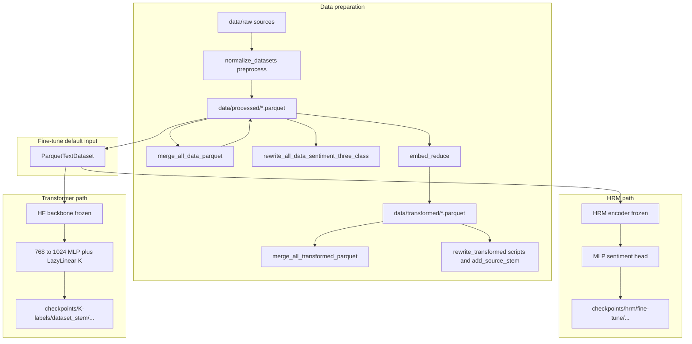

# Fine-tuning and data pipeline — consolidated implementation summary

**Last updated:** 2026-04-02  

**Purpose:** Single entry point for **HRM MLP fine-tune**, **transformer (Hugging Face) MLP-head fine-tune**, and the **processed / transformed parquet** tooling that feeds `train_single.py`.  

**Scope:** What is implemented today for head-only supervised fine-tuning, DDP, resume, and data prep. **Out of scope here:** mixture-of-experts stacking, Q-LoRA, and other items listed as later work in `docs/task.txt` (not treated as done unless separately verified).

**Deep dives:**  
- [Transformer MLP head fine-tune](summary/transformer_mlp_head_finetune_implementation.md)  
- [HRM MLP head fine-tune](summary/hrm_mlp_head_finetune_implementation.md)  
- Smoke: [transformer smoke](summary/transformer_mlp_finetune_smoke_implementation.md), [HRM smoke](summary/hrm_mlp_finetune_smoke_implementation.md)

---

## End-to-end flow



**Training default:** Supervised fine-tune reads `data/processed/{dataset_stem}.parquet` via `ParquetTextDataset` in `Code/thesis/common/datasets.py`. The `data/transformed/` tree holds embeddings and related columns for downstream or analysis; merging transformed shards does **not** replace the processed-text path unless you explicitly change training config and loaders.

---

## Data: `processed` vs `transformed`

| Location | Role |
|----------|------|
| `data/processed/{stem}.parquet` | Text + integer labels (`sentiment_value` / inferred columns). Primary input for `train_single.py` finetune with `--data_root data` and `--dataset_stem`. |
| `data/transformed/{stem}.parquet` | Typically includes reduced embeddings (e.g. after UMAP) and aligned labels; used by embedding pipelines and some rewrites. |

### Scripts (`Code/thesis/data/`)

| Script | Purpose |
|--------|---------|
| `normalize_datasets.py` | Normalize raw CSV/parquet into `data/processed/*.parquet` (optional `--flush-processed` rebuilds entire processed dir). |
| `preprocess.py` | Clean text from raw into processed parquets (uses `Code/data/clean_text.py`). |
| `merge_all_data_parquet.py` | Build `data/processed/all-data.parquet` from other processed parquets; optional safe delete of sources after merge. |
| `rewrite_all_data_sentiment_three_class.py` | Rewrite `processed/all-data.parquet` so `sentiment_value` is only 0/1/2 using `normalize_label_for_n_classes` rules. |
| `filter_empty_text.py` | Drop empty `text` rows in processed parquets in place; skips `all-data.parquet` unless opted in. |
| `embed_reduce.py` | SentenceTransformer + UMAP: processed → transformed parquets (see script for CLI). |
| `merge_all_transformed_parquet.py` | Merge `data/transformed/*.parquet` into `transformed/all-data.parquet` with `source_stem` per row. **Caveat:** each stem may have been embedded with its **own** UMAP fit; concatenating mixes embedding spaces. For one consistent 100D space across the full corpus, merge **processed** first, then run `embed_reduce.py --only all-data --force` (as noted in that script’s docstring). |
| `rewrite_transformed_sentiment_three_class.py` | Rewrite **every** row of `transformed/all-data.parquet` `sentiment_value` to 0/1/2 aligned with processed labeling; preserves `features_100d`. |
| `rewrite_transformed_star_labels_three_class.py` | Same normalization rules for **star-rating sources only** in transformed `all-data` (row order aligned with processed). |
| `add_source_stem_to_transformed_parquet.py` | Append `source_stem` to `transformed/all-data.parquet` using aligned `processed/all-data.parquet`. |
| `merge_tweets_eval.py`, `process_yelp_custom.py`, `create_dummy_data.py` | Additional dataset-specific or utility pipelines (see file headers). |

---

## HRM supervised fine-tune (condensed)

- **Model:** Frozen `HierarchicalReasoningModel` loaded from MLM pretrain (e.g. `checkpoints/hrm/pretrain/{stem}/E_HRM1_4Level.safetensors`); trainable **deep MLP head** (100-D pooled → … → K logits). Loss: `CrossEntropyLoss` on logits (no softmax in the module).
- **Configs:** `Code/thesis/config/hrm/E_HRM1_4Level_ft_mlp_2label.json`, `..._3label.json` (see [HRM summary](summary/hrm_mlp_head_finetune_implementation.md)).
- **2-label vs neutral:** For HRM with `n_classes == 2`, rows with neutral label `2` are **dropped by default**. Use `--no_hrm_exclude_neutral` on `train_single.py` to keep them.
- **Checkpoints:** With `--hrm_finetune_checkpoint_layout` and `checkpoint_root` under `checkpoints/hrm`, saves follow `checkpoints/hrm/fine-tune/{dataset_stem}/{K}-labels/{config_stem}.safetensors`. Env `THESIS_HRM_FINETUNE_CKPT_LAYOUT` mirrors the flag.
- **Launchers:** `scripts/run_hrm_finetune_mlp.sh` (main), `run_hrm_finetune_mlp_2label.sh` / `_3label.sh`, plus machine-specific wrappers (`*_4xl40s*.sh`, `*_sequential*.sh`, etc.).
- **Details:** Env vars, VRAM tier batching, smoke under `DUMMY/fine-tune/`, and manual `torchrun` examples → [hrm_mlp_head_finetune_implementation.md](summary/hrm_mlp_head_finetune_implementation.md).

---

## Transformer MLP fine-tune (condensed)

- **Model:** Frozen Hugging Face backbone (`LLMModule` / `AutoModel`); head is **768 → Linear(1024) → GELU → LazyLinear(K)** when `single_linear_head=false` in JSON (`DLModelLayers`). Loss: `CrossEntropyLoss` on logits.
- **Configs:** `Code/thesis/config/transformers/2_labels/` and `3_labels/`: **B3** DistilBERT, **B4** BERT, **B5** RoBERTa, **B6** BART (`*_mlp768_1024.json`).
- **2-label vs HRM:** `exclude_neutral` for 2-class applies to **HRM only**. **Transformer 2-class runs keep all rows**, including neutral `2`, unless you add a separate dataset filter later ([transformer summary](summary/transformer_mlp_head_finetune_implementation.md)).
- **Checkpoints:** `{checkpoint_root}/{K}-labels/{dataset_stem}/{config_stem}.safetensors` (no HRM layout flag).
- **Run all eight (4 models × 2 label modes):** `scripts/run_transformer_mlp_finetune_4xl40s_sequential_all8.sh` runs `THESIS_TRANSFORMER_RUN_ALL=1` for **3-label** (B3–B6), then **2-label** (B3–B6); `THESIS_DETACH=none` so the script blocks (wrap in tmux/screen at the caller for long SSH sessions).
- **Queue after HRM 2-label:** `scripts/queue_transformer_mlp_all8_after_hrm_2label.sh` polls until no `train_single.py` process matches the HRM 2-label config pattern, then starts the sequential all-8 transformer run in a **new** tmux session (default `transformer_ft_all8`).
- **Details:** Env vars (`THESIS_TRANSFORMER_FINETUNE_BATCH`, `THESIS_TRANSFORMER_RUN_ALL`, resume knobs, GPU monitor), wrappers `run_transformer_mlp_finetune_2label.sh` / `_3label.sh`, `_4xl40s.sh` → [transformer_mlp_head_finetune_implementation.md](summary/transformer_mlp_head_finetune_implementation.md).

---

## Shared training entrypoint and resume

- **CLI:** `Code/thesis/train/train_single.py` with `--phase finetune`, `--epochs_finetune`, `--batch_size`, `--n_classes`, `--dataset_stem`, `--config`, `--data_root`, `--checkpoint_root`, `--log_dir`, etc.
- **DDP:** Launchers use `python -m torch.distributed.run --nproc_per_node=...` (or env-driven equivalents).
- **Resume:** Periodic and live resume via `THESIS_RESUME_TEMP` (default under `logs/resume/`), `THESIS_SAVE_EVERY_STEPS`, `THESIS_SAVE_EVERY_MINUTES`, `THESIS_MIN_SAVE_INTERVAL_SEC`, and `THESIS_NO_RESUME`; implementation in `Code/thesis/common/resume_checkpoint.py` and loops in `train_single.py`. Full tables → linked summaries above.

---

## Operations: logs and checkpoints (read-only pointers)

Typical tee / monitor logs under `logs/` (inspect manually; do not delete or truncate while jobs run):

| Pattern | Typical use |
|---------|-------------|
| `logs/hrm_finetune_mlp_2label.log`, `logs/hrm_finetune_mlp_3label.log` | HRM MLP finetune |
| `logs/hrm_finetune_gpu_monitor.log` | Optional GPU sampling |
| `logs/transformer_finetune_mlp_*_{2,3}label.log` | Per-model transformer runs when using `THESIS_TRANSFORMER_RUN_ALL` or explicit stems |
| `logs/transformer_ft_all8_full_run.log` | Long sequential all-8 run (if configured) |
| `logs/transformer_finetune_gpu_monitor.log` | Transformer GPU monitor |
| `logs/queue_transformer_after_hrm_2l.log` | Queue script stdout if redirected |

Resume metadata and interrupt bundles: `logs/resume/` (see `meta.json` under slugged subdirs).

---

## Related documentation

| Document | Content |
|----------|---------|
| [summary/transformer_mlp_head_finetune_implementation.md](summary/transformer_mlp_head_finetune_implementation.md) | Transformer configs, scripts, env, manual torchrun |
| [summary/hrm_mlp_head_finetune_implementation.md](summary/hrm_mlp_head_finetune_implementation.md) | HRM head topology, checkpoints, batch tiers, smoke |
| [summary/transformer_mlp_finetune_smoke_implementation.md](summary/transformer_mlp_finetune_smoke_implementation.md) | Transformer smoke / interrupt demo |
| [summary/hrm_mlp_finetune_smoke_implementation.md](summary/hrm_mlp_finetune_smoke_implementation.md) | HRM smoke / sandbox |
| `docs/task.txt` | Broader roadmap (per-dataset finetune, MoE, Q-LoRA, etc.) — verify separately before claiming implemented |

---

## Quick command index (repo root = directory containing `Code/`)

```bash
# HRM 3-class then 2-class (see HRM summary for detach defaults)
bash scripts/run_hrm_finetune_mlp_3label.sh
bash scripts/run_hrm_finetune_mlp_2label.sh

# Transformer: single config on 4 GPUs (example)
bash scripts/run_transformer_mlp_finetune_4xl40s.sh 3 B3_E_DL1_DistilBERT_mlp768_1024

# Transformer: all eight finetunes sequentially (3-label four models, then 2-label four)
bash scripts/run_transformer_mlp_finetune_4xl40s_sequential_all8.sh

# After HRM 2-label exits: queue all-eight transformer run in tmux
bash scripts/queue_transformer_mlp_all8_after_hrm_2label.sh
```

Foreground / no detach: set `THESIS_DETACH=none` on the relevant launcher (see linked summaries).
