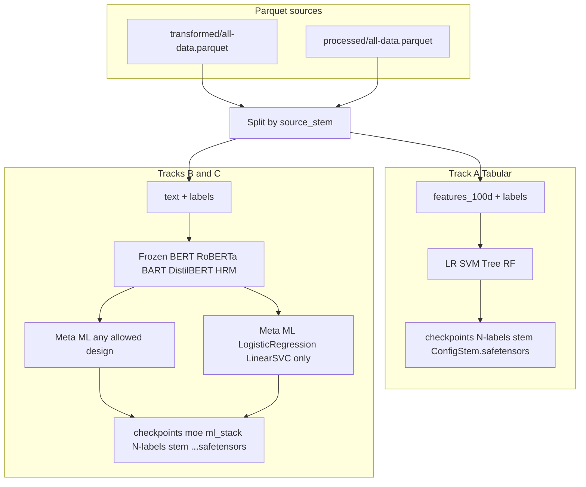

# ML training pipelines specification

This document defines three related training tracks for sentiment classification: tabular classical models on transformed features, frozen deep encoders with trainable shallow meta-learners, and a restricted processed-data track using only SVC and logistic regression. It aligns with [docs/task.txt](../task.txt), [docs/Model_Parameters_and_Stacking.md](../Model_Parameters_and_Stacking.md), and the current thesis training layout in `Code/thesis/train/`.

---

## 1. Scope and goals

- **Checkpoints:** Prefer `.safetensors` for all saved weights, per project rules in `docs/task.txt`.
- **Logs:** All training logs under `logs/` only.
- **Progress:** Use `tqdm` (or equivalent) in training loops where applicable.
- **CPU emphasis:** Tabular sklearn-style training runs on CPU; no GPU requirement for Track A. Tracks B and C may use GPU for encoder forward passes while keeping encoder weights frozen.
- **Separation of concerns:** Train **2-label** and **3-label** tasks separately. Train **each dataset** separately when using merged `all-data.parquet`, using `source_stem` (see below).

This specification describes intended behavior and paths. Some items (for example `checkpoints/moe/ml_stack/` layout, Track B/C orchestration scripts) may require additional implementation beyond what exists today.

---

## 2. Shared conventions

### 2.1 Label modes

- **2-label:** Binary classification; define explicitly how neutral labels (`sentiment_value == 2` or project equivalent) are handled per model family. Transformer 2-class runs may differ from HRM (see summaries under `docs/spheron/docs/summary/`).
- **3-label:** Three-way classification (e.g. negative / neutral / positive).

Checkpoint roots follow the thesis convention: under `checkpoints/`, use **`2-labels`** vs **`3-labels`** directory names (with a hyphen), matching `Code/thesis/train/train_single.py` (`_checkpoint_path`).

### 2.2 Per-dataset training from merged parquet

Merged files:

- `data/transformed/all-data.parquet` — built by merging per-stem transformed shards; includes **`source_stem`** on each row.
- `data/processed/all-data.parquet` — built from processed shards; may include **`source_stem`** for traceability.

**Canonical split:** For each distinct `source_stem` value, filter rows (or `groupby("source_stem")`) and treat that subset as one dataset. The **`dataset_stem`** argument passed to training entrypoints should match that stem (e.g. `imdb`, `amazon`, not `all-data`), unless you intentionally train on the full merged file.

**Queue / listing note:** If only `all-data.parquet` remains under `data/transformed/`, some scripts omit `all-data` from the stem list unless `THESIS_QUEUE_INCLUDE_ALL_DATA` is set. See [scripts/README.md](../../scripts/README.md).

### 2.3 Logging (recommended naming)

Until unified scripts enforce names, use a consistent pattern, for example:

- `logs/ml_tabular_{dataset_stem}_{2|3}label_{model_short}.log`
- `logs/ml_stack_embed_{dataset_stem}_{2|3}label_{encoder}_{meta}.log`
- `logs/ml_stack_proc_{dataset_stem}_{2|3}label_{lr|svc}.log`

Tee stdout/stderr from the process that invokes `train_single.py` (or future stack runners) into these files.

### 2.4 Safetensors and classical estimators

`Code/models/utils/utils.py` (`MLModule.save_pretrained` with `save_type == 'safetensors'`) warns that saving as safetensors **may lose non-parameter state** (for example tree structure or fitted attributes not represented as tensors).

**Project rule:** Use `.safetensors` when the fitted `MLModule` `state_dict()` is sufficient to restore inference. If an estimator cannot be recovered reliably from tensors alone, document the exception and use full-object `.pt` / `.pth` for that model, or extend serialization explicitly. Do not silently assume trees or forests round-trip through safetensors without verification.

---

## 3. Track A — Tabular classical ML (transformed features)

### 3.1 Purpose

Train traditional classifiers on **100-dimensional** reduced features from the transformed pipeline (SentenceTransformer embedding + UMAP), not on raw text.

### 3.2 Input data

- **File:** `data/transformed/all-data.parquet`
- **Columns:** Feature column(s) as produced by `Code/thesis/data/embed_reduce.py` (e.g. `features_100d`) and label column **`sentiment_value`** (required by the thesis dataset loaders).
- **Splits:** Filter by **`source_stem`** so each training job corresponds to one logical dataset.

### 3.3 Models

Train **separately** for each `(dataset_stem, label_mode)`:

| Algorithm | Notes |
|-----------|--------|
| Logistic regression | Config exists: `E_ML1_LogisticRegression.json` |
| SVM | Project configs use **`LinearSVC`** (`E_ML2_LinearSVC.json`), not kernel SVM in the default generator |
| Decision tree | **No thesis JSON yet** — add under `Code/thesis/config/ml/{2_labels,3_labels}/` |
| Random forest | **No thesis JSON yet** — same |

Top-level JSON keys must match class names discoverable by `Code/thesis/common/model_factory.py` (e.g. `DecisionTreeClassifier`, `RandomForestClassifier` from `Code/models/machine_learning/classification/`).

### 3.4 Execution

- **Entrypoint:** `Code/thesis/train/train_single.py` with a config under `Code/thesis/config/ml/...`, transformed parquet path implied by `--dataset_stem` and `data/transformed/{stem}.parquet`, or equivalent project convention.
- **Device:** Classical branch loads all samples and calls `fit` in memory — **CPU**; there is no mini-batch training loop for sklearn inside that path. For speed, tune hyperparameters in JSON (`solver`, `max_iter`, `n_jobs` where supported by the wrapped class).

### 3.5 Checkpoint layout (current code)

Matches `_checkpoint_path` in `train_single.py`:

```text
checkpoints/{2|3}-labels/{dataset_stem}/{ConfigStem}.safetensors
```

Example: `checkpoints/2-labels/imdb/E_ML1_LogisticRegression.safetensors`.

Terminology: this is the **tabular / classical ML** family of checkpoints; there is **no** separate `checkpoints/machine_learning/` directory in the current implementation.

### 3.6 Gap

Add JSON configs (and verify safetensors round-trip) for **decision tree** and **random forest** for both `2_labels` and `3_labels`.

---

## 4. Track B — Frozen transformer + HRM embeddings, meta-ML (`moe/ml_stack`)

### 4.1 Purpose

Use **frozen** encoder weights to produce embeddings, then train **only** shallow or classical meta-models on those features. Encoder backbones are not updated.

### 4.2 Input data

- **File:** `data/processed/all-data.parquet`
- **Columns:** Text (via project text column convention) and labels; split rows by **`source_stem`** for per-dataset runs.

### 4.3 Encoders (inference only)

| Encoder | Role |
|---------|------|
| BERT base | Expert **E-DL3** (`bert_base`) |
| RoBERTa base | **E-DL2** |
| BART base | Seq2seq encoder side per project configs |
| DistilBERT | **E-DL1** |
| HRM | **E-HRM1**; load weights from `checkpoints/hrm/` (exact filenames depend on your trained artifacts) |

Weights for transformers and HRM stay **frozen** (`requires_grad=False`); only the meta-classifier (or sklearn head on concatenated embeddings) trains.

### 4.4 Procedure (specification level)

1. For each `(dataset_stem, label_mode)`, build a dataloader over filtered processed rows.
2. For each encoder (and optionally combinations), run forward passes to obtain fixed-size embedding vectors (pooling strategy must be fixed and documented per encoder type).
3. Optionally **cache** embeddings to disk (e.g. parquet or tensor files) to avoid repeated forward passes.
4. Concatenate or stack embeddings as designed; train meta-model (e.g. single `Linear`, or `LogisticRegression` / `LinearSVC` wrappers from `Code/models`).
5. Save only the **trainable** meta weights as `.safetensors` where valid; document any use of `.pt` per section 2.4.

### 4.5 Checkpoint layout (target)

Store artifacts under:

```text
checkpoints/moe/ml_stack/{2|3}-labels/{dataset_stem}/{EncoderOrCombo}_{MetaModel}.safetensors
```

Examples (illustrative):

- `checkpoints/moe/ml_stack/3-labels/imdb/DistilBERT_LogisticRegression.safetensors`
- `checkpoints/moe/ml_stack/2-labels/amazon/BERT_RoBERTa_BART_DistilBERT_HRM_concat_Linear.safetensors`

**Note:** `Code/thesis/train/train_moe.py` today defaults gate output to `checkpoints/moe/` without the `ml_stack` subtree. Aligning on-disk layout with this spec is a follow-up code change.

### 4.6 Related code

- `Code/models/` — `LLMModule`, HRM wrappers, `MLModule` sklearn bridges.
- `Code/thesis/train/train_stack.py` — pattern for combining **frozen** experts and training a meta-head (adapt conceptually when meta-inputs are embeddings rather than logits).

---

## 5. Track C — Processed data, SVC and logistic regression only

### 5.1 Purpose

Same data and freezing rules as Track B, but **meta-models are restricted** to **SVC** and **logistic regression** only, consistent with **E-ML1** and **E-ML2** in [docs/Model_Parameters_and_Stacking.md](../Model_Parameters_and_Stacking.md) and the high-level rules in `docs/task.txt`.

### 5.2 Input and splits

- **File:** `data/processed/all-data.parquet`
- **Splits:** **`source_stem`** per dataset; **2-label** vs **3-label** runs separate.

### 5.3 Training

- Encoders (BERT, RoBERTa, BART, DistilBERT, HRM) remain **frozen**.
- Only **logistic regression** and **SVC** (or project’s `LinearSVC` wrapper) are trained on the resulting feature matrix (embeddings or concatenated embeddings).

### 5.4 Checkpoint layout

Use the **same** subtree as Track B with **unambiguous filenames** so Track C artifacts are not confused with other meta-models:

```text
checkpoints/moe/ml_stack/{2|3}-labels/{dataset_stem}/proc_{LogisticRegression|LinearSVC}_{encoder_descriptor}.safetensors
```

The `proc_` prefix denotes the **processed-pipeline, E-ML1/E-ML2-only** restriction. If you prefer a parallel folder instead (e.g. `checkpoints/moe/ml_stack_proc/`), choose one convention for the whole project and document it in runbooks; the filename-prefix approach avoids a second root.

---

## 6. End-to-end flow (diagram)



---

## 7. Definition of done (for this documentation)

A reader can answer without guessing:

| Question | Answer location |
|----------|-----------------|
| Which parquet for tabular classical ML? | Section 3 — `data/transformed/all-data.parquet` |
| Which parquet for embedding / processed stacks? | Sections 4–5 — `data/processed/all-data.parquet` |
| How to recover per-dataset subsets? | Section 2.2 — `source_stem` |
| Where do Track A checkpoints go? | Section 3.5 — `checkpoints/{2,3}-labels/{dataset_stem}/` |
| Where do Track B/C checkpoints go? | Sections 4.5–5.4 — `checkpoints/moe/ml_stack/...` (target) |
| Where do logs go? | Section 1 — `logs/`; Section 2.3 — naming suggestions |
| Which configs exist vs missing? | Section 3.6 — tree/forest JSON gap |
| Safetensors risks for sklearn? | Section 2.4 — `MLModule` warning |

---

## 8. Suggested implementation follow-up (out of scope for docs only)

- Add `DecisionTreeClassifier` and `RandomForestClassifier` JSON configs under `Code/thesis/config/ml/`.
- Implement or extend runners that write to `checkpoints/moe/ml_stack/` and enforce Track C naming (`proc_...`).
- Add shell wrappers under `scripts/` that loop over `source_stem` values and label modes, teeing logs per section 2.3.
