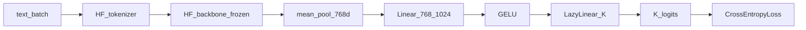

# Transformer MLP head fine-tune — implementation summary

**Last updated:** 2026-04-02

**Related:** Sandbox smoke write-up: [`transformer_mlp_finetune_smoke_implementation.md`](transformer_mlp_finetune_smoke_implementation.md)  
**Parity reference:** HRM MLP summary: [`hrm_mlp_head_finetune_implementation.md`](hrm_mlp_head_finetune_implementation.md)

---

## Purpose

Frozen **Hugging Face transformer** backbone (`LLMModule` / `AutoModel`) plus a **trainable head** for **2- or 3-way** sentiment: **768-D** pooled embeddings → **Linear(768, 1024)** → **GELU** → **Linear(1024, K)** (`nn.LazyLinear`); **supervised** fine-tune on **processed** parquet; **DDP** via `torch.distributed.run` and the same **periodic resume** knobs as other `train_single` text paths.

---

## Overview

- **Backbone:** Pretrained weights from the Hub (or local `checkpoint_dir` cache). **Frozen** during fine-tune (`train_loop_llm` with `head_only=True` → `set_backbone_trainable(False)`).
- **Head:** `single_linear_head=false` in JSON → `DLModelLayers` (768→1024 + GELU) + `LazyLinear(K)`. Training uses **`CrossEntropyLoss` on logits** (no softmax module in the graph).
- **Data:** `data/processed/{dataset_stem}.parquet` via `ParquetTextDataset`. Default stem **`all-data`**.
- **2-label vs HRM:** `exclude_neutral` in `train_single` applies only when the config is **HRM**. **`LLMModule` 2-class runs keep all rows**, including neutral label `2`, unless you add a separate dataset flag later.

---

## Architecture



---

## Configs (thesis)

| Path pattern | Role |
|--------------|------|
| `Code/thesis/config/transformers/2_labels/B3_E_DL1_DistilBERT_mlp768_1024.json` | DistilBERT, 2-class |
| `Code/thesis/config/transformers/3_labels/B3_E_DL1_DistilBERT_mlp768_1024.json` | DistilBERT, 3-class |
| `.../B4_E_DL3_BERT_mlp768_1024.json` | BERT (`google-bert/bert-base-uncased`) |
| `.../B5_E_DL2_RoBERTa_mlp768_1024.json` | RoBERTa |
| `.../B6_BART_mlp768_1024.json` | BART (`facebook/bart-base`) |

---

## Checkpoints (not HRM layout)

Fine-tune saves under:

`{checkpoint_root}/{K}-labels/{dataset_stem}/{config_stem}.safetensors`

Example with default `checkpoint_root=checkpoints` and `dataset_stem=all-data`:

`checkpoints/2-labels/all-data/B3_E_DL1_DistilBERT_mlp768_1024.safetensors`

There is **no** `--hrm_finetune_checkpoint_layout` for transformers; paths follow `_checkpoint_path` in `train_single.py`.

---

## Scripts

| Path | Role |
|------|------|
| `scripts/run_transformer_mlp_finetune.sh` | Main launcher: labels `2`/`3`, optional `config_stem`, DDP, tee log, `THESIS_DETACH` |
| `scripts/run_transformer_mlp_finetune_2label.sh` | Wrapper → `… finetune.sh 2 "$@"` |
| `scripts/run_transformer_mlp_finetune_3label.sh` | Wrapper → `… finetune.sh 3 "$@"` |
| `scripts/run_transformer_mlp_finetune_4xl40s.sh` | `CUDA_VISIBLE_DEVICES=0,1,2,3`, `nproc=4`, batch **32** per GPU |

---

## Code

| Path | Role |
|------|------|
| `Code/models/deep_learning/llm/llm_models.py` | `LLMModule`, `DLModelLayers` + `LazyLinear` head |
| `Code/models/deep_learning/models.py` | `DLModelLayers` layer specs |
| `Code/thesis/common/model_factory.py` | Builds `LLMModule` from JSON |
| `Code/thesis/train/train_single.py` | `train_loop_llm`, CLI, checkpoint path |
| `Code/thesis/tools/transformer_mlp_head_smoke.py` | Optional one-step forward smoke |

---

## Environment variables (quick reference)

| Variable | Purpose |
|----------|---------|
| `THESIS_PYTHON` | Python binary |
| `THESIS_DETACH`, `THESIS_SESSION` | `tmux` (default) / `none` / `screen` / `nohup` |
| `CUDA_VISIBLE_DEVICES`, `THESIS_NPROC_PER_NODE` | GPU list and process count |
| `THESIS_TRANSFORMER_FINETUNE_BATCH` | Per-GPU `--batch_size` (script default **32** when VRAM allows) |
| `THESIS_EPOCHS_FINETUNE` | `--epochs_finetune` (default **2** in launcher) |
| `THESIS_LR` | Learning rate (default **1e-3** for head-only) |
| `THESIS_TRANSFORMER_CFG_STEM` | JSON stem (e.g. `B3_E_DL1_DistilBERT_mlp768_1024`) |
| `THESIS_TRANSFORMER_DATASET_STEM` | Parquet stem (default `all-data`) |
| `THESIS_DATA_ROOT` | Parent of `processed/` |
| `THESIS_CHECKPOINT_ROOT` | Checkpoint root (default `checkpoints`) |
| `THESIS_RESUME_TEMP`, `THESIS_NO_RESUME` | Live resume |
| `THESIS_SAVE_EVERY_STEPS`, `THESIS_SAVE_EVERY_MINUTES`, `THESIS_MIN_SAVE_INTERVAL_SEC` | Periodic resume |
| `THESIS_MAX_SAMPLES` | Row cap (smoke / debugging) |
| `THESIS_TRANSFORMER_FINETUNE_LOG` | Tee log path |
| `THESIS_TRANSFORMER_RUN_ALL` | `1`/`true`/`yes`: run all four B3–B6 MLP configs sequentially (`THESIS_DETACH` defaults to `none`); each model gets its own tee log under `logs/transformer_finetune_mlp_{model}_${LABELS}label.log` |

---

## Recommended usage (Linux)

```bash
cd /path/to/repo   # directory containing Code/

export CUDA_VISIBLE_DEVICES=0,1,2,3
bash scripts/run_transformer_mlp_finetune_4xl40s.sh 3 B3_E_DL1_DistilBERT_mlp768_1024

# Foreground (no tmux):
THESIS_DETACH=none bash scripts/run_transformer_mlp_finetune_3label.sh B5_E_DL2_RoBERTa_mlp768_1024

# All four models, 3-class (sequential):
THESIS_TRANSFORMER_RUN_ALL=1 THESIS_DETACH=none bash scripts/run_transformer_mlp_finetune_4xl40s.sh 3
```

**Full matrix (4 models × 2 label modes):** run `THESIS_TRANSFORMER_RUN_ALL=1` with labels `3`, then repeat with labels `2`, or invoke eight explicit `config_stem` runs.

---

## Manual `torchrun` (illustrative)

```bash
cd /path/to/repo
python3 -m torch.distributed.run --nproc_per_node=4 \
  Code/thesis/train/train_single.py \
  --config Code/thesis/config/transformers/2_labels/B3_E_DL1_DistilBERT_mlp768_1024.json \
  --dataset_stem all-data \
  --data_root data \
  --checkpoint_root checkpoints \
  --log_dir logs \
  --phase finetune \
  --epochs_pretrain 0 \
  --epochs_finetune 2 \
  --batch_size 32 \
  --n_classes 2 \
  --lr 1e-3 \
  --num_workers 8 \
  --gc_every 50
```

---

## Smoke and interrupt demo

See [`transformer_mlp_finetune_smoke_implementation.md`](transformer_mlp_finetune_smoke_implementation.md).

---

## Notes

- **BART:** If `AutoModel` forward errors for encoder-only pooling, verify `get_embeddings` / model class for `facebook/bart-base` and adjust the HF wrapper if needed.
- **GPU monitor:** Optional `logs/transformer_finetune_gpu_monitor.log` when `THESIS_ENABLE_GPU_MONITOR` is not disabled (same pattern as HRM launcher).
