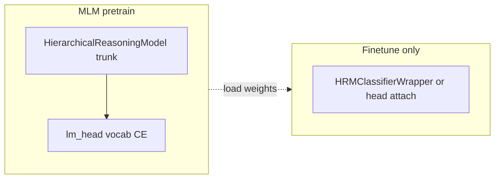

# HRM encoder-only MLM pretrain: validation and time estimate

## HRM-only script, logs under `logs/`, tmux / nohup

Use `**[scripts/run_hrm_encoder_pretrain_only.sh](d:/CAPSTONE/TEMP/scripts/run_hrm_encoder_pretrain_only.sh)**` — it runs **nothing except** encoder-only HRM MLM (`train_single.py`, no queue, no finetune).

**Log file (all modes append here):** `logs/hrm_encoder_pretrain_only.log`  
Override path: `THESIS_HRM_PRETRAIN_LOG=/path/to/file.log`

**Resume snapshots:** `logs/resume/` (or `THESIS_RESUME_TEMP`)

**Foreground** (stdout + tee to log):

```bash
cd /path/to/repo
export CUDA_VISIBLE_DEVICES=0,1
export THESIS_EPOCHS_PRETRAIN=2
bash scripts/run_hrm_encoder_pretrain_only.sh
```

**tmux** (detached; same log file via tee inside `__inner`):

```bash
cd /path/to/repo
export THESIS_DETACH=tmux
export THESIS_SESSION=hrm_enc_pretrain
export CUDA_VISIBLE_DEVICES=0,1
export THESIS_EPOCHS_PRETRAIN=2
bash scripts/run_hrm_encoder_pretrain_only.sh
# attach: tmux attach -t hrm_enc_pretrain
# follow log: tail -f logs/hrm_encoder_pretrain_only.log
```

**nohup** (background; output only in log):

```bash
cd /path/to/repo
export THESIS_DETACH=nohup
export CUDA_VISIBLE_DEVICES=0,1
export THESIS_EPOCHS_PRETRAIN=2
bash scripts/run_hrm_encoder_pretrain_only.sh
# tail -f logs/hrm_encoder_pretrain_only.log
```

**screen** (optional): `export THESIS_DETACH=screen` then same as tmux pattern.

`train_single.py` also receives `--log_dir "$ROOT/logs"` for any framework-side logs.

---

## Local vs cloud hardware


| Environment | Hardware                                                 | Use for                                                                                                                                             |
| ----------- | -------------------------------------------------------- | --------------------------------------------------------------------------------------------------------------------------------------------------- |
| **Local**   | **RTX 4070 8GB (laptop)**                                | Forward/backward smoke, `LiveResumeDir` unit checks, **short** periodic-save integration with `**--max_samples`**, single-GPU `train_single.py`     |
| **Cloud**   | **Dual RTX Pro 6000 Blackwell (96GB)** (or your SSH VMs) | **DDP** + SIGTERM resume stress test, **realistic `batch_size`**, **t_step** benchmark to estimate **2-epoch** wall time on full `all-data.parquet` |


**4070 8GB reality check:** `[run_hrm_encoder_pretrain_only.sh](d:/CAPSTONE/TEMP/scripts/run_hrm_encoder_pretrain_only.sh)` uses the same VRAM tiers as the thesis script; at `**seq_len` 512** and full E-HRM1 width, **batch 1** may still be tight. If MLM OOMs locally, use `**export THESIS_HRM_BATCH=1`**, `**THESIS_NUM_WORKERS=0`**, close other GPU apps, and optionally a **tiny JSON override** (e.g. lower `seq_len` / `hidden_size`) **only for smoke**—not for claiming production throughput.

**Do not** use laptop **seconds/step** to forecast Blackwell dual-GPU epoch hours; notebooks throttle, smaller batches, and different clocks dominate.

---

## Wording correction (why the earlier plan was wrong)

**You asked for single HRM encoder(-trunk) pretrain.** An older draft said `**n_classes=2` / “wrapper” / `checkpoints/2-labels/`**, which reads as sentiment pretrain. MLM only trains trunk + `lm_head`; the K-way head in `HRMClassifierWrapper` is unused in that path. Target: bare `**HierarchicalReasoningModel`**, artifacts under `**checkpoints/pretrain/...**`, aligned with `[feature_models_all-data_pretrain_e9470305.plan.md](d:/CAPSTONE/TEMP/docs/plans/feature_models_all-data_pretrain_e9470305.plan.md)`.

---

## What the stack does (after alignment)


| Concern                         | Where it lives                                                                                                  |
| ------------------------------- | --------------------------------------------------------------------------------------------------------------- |
| HRM MLM forward + loss          | `[train_single.py](d:/CAPSTONE/TEMP/Code/thesis/train/train_single.py)` — `_hrm_mlm_step`; `train_loop_hrm_mlm` |
| Periodic + end-of-epoch resume  | `_maybe_periodic_resume_save`; epoch-end `live.save`                                                            |
| Resume load + batch skip        | `[resume_checkpoint.py](d:/CAPSTONE/TEMP/Code/thesis/common/resume_checkpoint.py)` — `try_restore_training`     |
| Final encoder pretrain artifact | **Target:** `checkpoints/pretrain/...` (K-agnostic)                                                             |





---

## 1. Implementation prerequisite (encoder-only pretrain)

Land `**code-hrm-pretrain-encoder-only**`: `model_factory` returns bare encoder for HRM pretrain; `train_single` checkpoint path without `n_labels`; shell drops `--n_classes` for MLM block. **HRM-only entry:** `run_hrm_encoder_pretrain_only.sh`.

---

## 2. Tests: local (RTX 4070 8GB laptop)

**A — Forward + backprop**

- Single GPU, `**CUDA_VISIBLE_DEVICES=0`**, `**--batch_size 1`** (try 2 only if stable). AMP on.
- Covered by pytest: `Code/test/test_hrm_encoder_only_factory.py` (CPU + optional CUDA).

**B — `LiveResumeDir`**

- `Code/test/test_live_resume_dir.py` (CPU, tiny module).

**C — Periodic saves**

- `train_single.py ... --phase pretrain ... --max_samples 500`, `**--batch_size 1`**, `**--num_workers 0`**, `**--save_every_steps 2**`, `**--min_save_interval_sec 1**`.
- Optional: unskip `Code/test/test_hrm_pretrain_integration_skips.py` after `DUMMY/build_mock_parquet.py`.

**D — DDP + SIGTERM**

- **Skip on laptop** (single GPU). Tracked as `**ddp-sigterm-resume-cloud`**.

**E — Final artifact**

- `checkpoints/pretrain/{stem}/E_HRM1_4Level.safetensors`; pytest: safetensors roundtrip in `test_hrm_encoder_only_factory.py`.

**Suggested local env**

```bash
export CUDA_VISIBLE_DEVICES=0
export THESIS_HRM_BATCH=1
export THESIS_NUM_WORKERS=0
bash scripts/run_hrm_encoder_pretrain_only.sh
```

---

## 3. Tests: cloud (dual Blackwell / SSH VMs)

- Repeat **A/C/E** at production `**batch_size`** (e.g. tier 64/GPU if VRAM allows).
- Use **tmux** or **nohup** + `tail -f logs/hrm_encoder_pretrain_only.log` for long runs.
- `**ddp-sigterm-resume-cloud`:** `torch.distributed.run --nproc_per_node=2`, periodic saves, SIGTERM, relaunch identical args.
- `**time-benchmark-cloud`:** warm-up 50–200 steps, record **t_step**; also `python Code/thesis/tools/hrm_pretrain_hours_estimate.py --parquet data/processed/all-data.parquet ...`

---

## 4. Two epochs on `all-data.parquet`: hours (HRM encoder-only)

Use **HRM-only** script (not the full thesis pipeline):

```bash
export THESIS_EPOCHS_PRETRAIN=2
export CUDA_VISIBLE_DEVICES=0,1
export THESIS_DETACH=tmux   # or nohup
bash scripts/run_hrm_encoder_pretrain_only.sh
```

Formula: measure **t_step** on the **target** GPUs; plug **N** (row count) into `hrm_pretrain_hours_estimate.py`.

---

## 5. Review note

Bare HRM MLM uses `**find_unused_parameters=False`** on DDP when applicable.