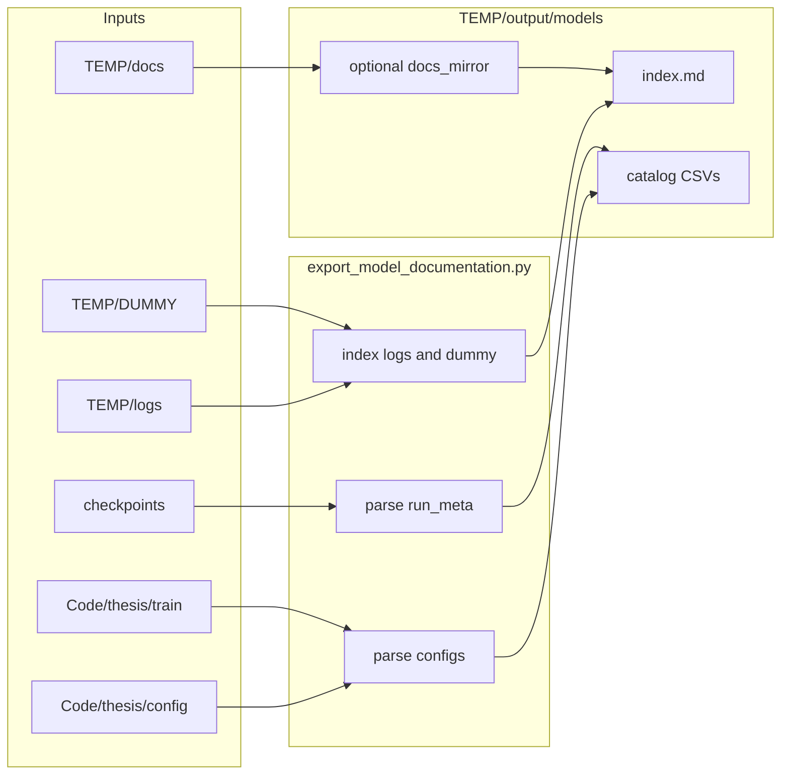

# Model documentation catalog under `TEMP/output/models`

## Goal

Produce a **single command** that regenerates a **model catalog** for the thesis: what each JSON config represents, which Python classes and training entrypoints apply, which checkpoint artifacts exist (with parsed `run_meta.txt`), and **pointers or copies** of human-written documentation from `[TEMP/docs](TEMP/docs)`, plus **lightweight indexes** of `[TEMP/logs](TEMP/logs)` and `[TEMP/DUMMY](TEMP/DUMMY)`. No live web scraping; methodology citations stay in existing docs.

## What already exists (reuse, do not duplicate logic blindly)

- **Config-to-class mapping narrative:** `[TEMP/docs/thesis_config_inventory.md](TEMP/docs/thesis_config_inventory.md)`
- **Conceptual model families:** `[TEMP/docs/models_overview.md](TEMP/docs/models_overview.md)`, `[TEMP/docs/Model_Parameters_and_Stacking.md](TEMP/docs/Model_Parameters_and_Stacking.md)`
- **Parameter counts:** `[TEMP/docs/thesis_parameter_counts.md](TEMP/docs/thesis_parameter_counts.md)` (from `[TEMP/Code/thesis/tools/count_model_params.py](TEMP/Code/thesis/tools/count_model_params.py)`)
- **Training pipelines / pretrain vs finetune:** `[TEMP/docs/ml/TRAINING_PIPELINES.md](TEMP/docs/ml/TRAINING_PIPELINES.md)`, `[TEMP/docs/Fine_tuning_and_data_pipeline_implementation_summary.md](TEMP/docs/Fine_tuning_and_data_pipeline_implementation_summary.md)`, `[TEMP/docs/hrm_encoder_pretrain_runbook.md](TEMP/docs/hrm_encoder_pretrain_runbook.md)`
- `**run_meta.txt` parsing pattern:** `[TEMP/Code/thesis/tools/eval_per_source_stem_metrics.py](TEMP/Code/thesis/tools/eval_per_source_stem_metrics.py)` (key=value lines; same structure as e.g. `[TEMP/checkpoints/mlp_geLU_head_ddp/combined/2-labels/all-data/cnn/run_meta.txt](TEMP/checkpoints/mlp_geLU_head_ddp/combined/2-labels/all-data/cnn/run_meta.txt)`)

## Proposed artifacts (written under `TEMP/output/models/`)

| Output                                         | Purpose                                                                                                                                                        |
| ---------------------------------------------- | -------------------------------------------------------------------------------------------------------------------------------------------------------------- |
| `index.md`                                     | Run timestamp, CLI args, short “how to read this folder,” links to child files                                                                                 |
| `configs_catalog.json` + `configs_catalog.csv` | One row per `Code/thesis/config/**/*.json` (relative path, top-level keys like `model_class` / `architecture` / `n_classes` if present, file mtime)            |
| `moe_manifests.json`                           | Parsed summaries of `[TEMP/Code/thesis/config/moe/*.json](TEMP/Code/thesis/config/moe)` (expert paths, labels)                                                 |
| `checkpoints_inventory.csv`                    | Each `*.safetensors` / `*.joblib` under `--checkpoint-root` with size, mtime; **join** parsed `run_meta.txt` in nearest parent directory when present          |
| `run_meta_parsed.jsonl`                        | One JSON object per `run_meta.txt` (flat key-values + source path) for tooling                                                                                 |
| `training_entrypoints.md`                      | Table: primary scripts under `[TEMP/Code/thesis/train/](TEMP/Code/thesis/train)` (from filename + optional one-line docstring grep) mapped to model families   |
| `scripts_index.md`                             | List `[TEMP/scripts/*.sh](TEMP/scripts)` with first comment block or `head` summary (no execution)                                                             |
| `documentation_sources.md`                     | Categorized list of **absolute/relative paths** to all `TEMP/docs/**/*.md` relevant to models (group: overview, training, pretrain, parameters, progress)      |
| `logs_index.csv`                               | For each file under `TEMP/logs/`**: path, size, mtime (optional `--max-log-files` cap sorted by mtime)                                                         |
| `dummy_smoke_index.md`                         | Index of `[TEMP/DUMMY](TEMP/DUMMY)` smoke scripts, logs, and `outputs/**/_eval.csv` paths (paths only; no large file inlining)                                 |
| `docs_mirror/` (optional)                      | If `--mirror-docs`: copy a **fixed allowlist** of markdown files (the sources above + `docs/ml/README.md`) so the output folder is self-contained for archival |

**Design choice:** Default is **indexes + catalogs**; full prose already lives in `TEMP/docs`. Mirroring is opt-in to avoid stale duplicates unless the user runs the exporter after doc edits.

## Implementation

1. **New tool:** `[TEMP/Code/thesis/tools/export_model_documentation.py](TEMP/Code/thesis/tools/export_model_documentation.py)`
  - Args: `--repo-root` (default: `Path(__file__).resolve().parents[3]` i.e. `TEMP`), `--output-dir` (default `output/models`), `--checkpoint-root`, `--docs-root`, `--logs-root`, `--dummy-root`, `--mirror-docs`, `--max-log-files`.  
  - **Config scan:** `rglob("*.json")` under `Code/thesis/config`, skip or tag `moe/` separately. Load JSON safely; record keys and `model_type`-like fields if present.  
  - **Checkpoint scan:** walk `checkpoints/` for weights + `run_meta.txt`; parse `key=value` lines (reuse the same line-splitting approach as eval tool).  
  - **Docs/logs/DUMMY:** filesystem metadata only unless `--mirror-docs` copies allowlisted files.  
  - **Training scripts:** `listdir` + read first ~40 lines of each `train_*.py` for a one-line summary if `"""` exists.
2. **Shell wrapper:** `[TEMP/scripts/run_export_model_documentation.sh](TEMP/scripts/run_export_model_documentation.sh)`
  - `cd` to `TEMP`, `PYTHONPATH=.`, invoke the Python module with quoted paths (same pattern as `[TEMP/scripts/run_dataset_analysis.sh](TEMP/scripts/run_dataset_analysis.sh)`).
3. **Verification**
  - Run once; confirm `index.md`, `configs_catalog.csv`, `checkpoints_inventory.csv`, and `run_meta_parsed.jsonl` non-empty when checkpoints exist.  
  - Spot-check one `run_meta.txt` row matches manual file contents.

## Non-goals

- Re-implementing full narrative thesis text inside the exporter (link/mirror authoritative docs instead).  
- Parsing multi-GB log files for metrics (only index paths/sizes unless you add a follow-up).  
- Auto-running `count_model_params.py` unless you add an explicit `--refresh-param-counts` flag (optional stretch; not required if `thesis_parameter_counts.md` is already maintained).

## Flow (mermaid)

