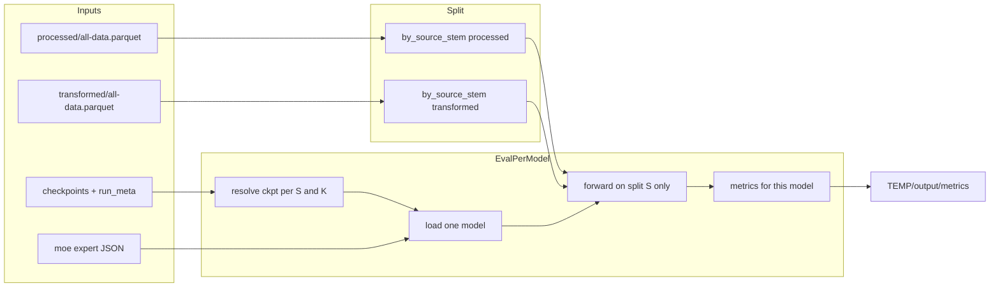

# Per-source_stem evaluation and metrics export

## Context (from repo)

- **Data:** `[TEMP/Code/thesis/common/datasets.py](TEMP/Code/thesis/common/datasets.py)` already implements `source_stem`-aware label normalization via `normalize_label_for_n_classes` for 2- and 3-class training. `ParquetTextDataset` / `ParquetFeaturesDataset` read processed vs transformed parquets respectively; text vs feature modality is determined by config path in `[TEMP/Code/thesis/common/model_factory.py](TEMP/Code/thesis/common/model_factory.py)` (`is_text_model_config_path`).
- **Single-model eval reference:** `[TEMP/Code/thesis/test/validate_all.py](TEMP/Code/thesis/test/validate_all.py)` — loads config + checkpoint, runs forward pass, handles ML joblib, CNN/RNN input reshaping, and LLM/HRM branches. This logic should be **reused or lightly refactored** (import helpers from a new `tools` module) rather than duplicated.
- **Checkpoint conventions:** `[TEMP/Code/thesis/train/train_single.py](TEMP/Code/thesis/train/train_single.py)` saves to `checkpoints/{K}-labels/{dataset_stem}/{ConfigStem}.safetensors` (and `.joblib` for tree/forest). Nested runs record `**run_meta.txt`** with `config=`, `n_classes=`, and paths (e.g. `[TEMP/checkpoints/mlp_geLU_head_ddp/.../run_meta.txt](TEMP/checkpoints/mlp_geLU_head_ddp/combined/2-labels/all-data/ffnn/run_meta.txt)`).
- **MoE:** `[TEMP/Code/thesis/train/train_moe.py](TEMP/Code/thesis/train/train_moe.py)` + `[TEMP/Code/thesis/train/moe_facade.py](TEMP/Code/thesis/train/moe_facade.py)`; expert manifests documented in `[TEMP/Code/thesis/config/moe/README.md](TEMP/Code/thesis/config/moe/README.md)`. **Unfine-tuned combination:** build experts from manifest (same as training), freeze all expert weights, and compute logits as **uniform average of expert logits** (equivalent to fixed `1/E` routing; no trained gate). Use `FeatureGatedMoE` when all experts are dense (typical `experts_all_data_{2,3}label.json`); forward can bypass the gate module by averaging stacked expert outputs in eval code to avoid random gate weights.
- **Docs to align with:** `[TEMP/docs/ml/TRAINING_PIPELINES.md](TEMP/docs/ml/TRAINING_PIPELINES.md)` (per-`source_stem` splits), `[TEMP/docs/thesis_config_inventory.md](TEMP/docs/thesis_config_inventory.md)` (config/modality), `[TEMP/docs/models_overview.md](TEMP/docs/models_overview.md)` (model families).

## Validation data and per-model isolation (required)

- **Split datasets are the validation sets:** For every `source_stem` **S**, metrics must be computed on `**TEMP/data/processed/by_source_stem/{safe_stem}.parquet`** (text models) and `**TEMP/data/transformed/by_source_stem/{safe_stem}.parquet`** (feature / dual / MoE paths)—not on `all-data.parquet`. Merged all-data is only used to *produce* the splits in Phase 1.
- **Each model evaluated separately:** For each distinct model entry (config + weight path from the index), run an **independent** eval pass—load that model, run forward on **only** the split files for **S**, write **one** `metrics.json` (and optional row in the summary table). Do not aggregate predictions across models or reuse one forward graph for multiple checkpoints. Order can be nested loops `(S, model)` or `(model, S)` but isolation is the same.
- **Checkpoint path vs validation path:** Training artifacts may live under `checkpoints/.../all-data/...` (fallback resolution); that only selects **weights**. **Data** for per-stem validation always comes from the **per-stem split** parquets above.

## Checkpoint resolution policy (your choice)

For each `source_stem` **S** and label mode **K** in `{2,3}`:

1. For each config/model id, prefer `**checkpoints/{K}-labels/{S}/{ConfigStem}.safetensors`** (and paired `.joblib` if applicable).
2. If missing, fall back to `**checkpoints/{K}-labels/all-data/{ConfigStem}.safetensors`** (and `.joblib`).
3. **Additional entries:** parse every `**run_meta.txt`** under `TEMP/checkpoints` and treat each as a distinct eval target (config path + weight file path(s) from metadata + `n_classes`), so nested layouts (e.g. `mlp_geLU_head_ddp`, `b11_cnn_lstm_stack_gelu_ddp`) are not dropped.

**Exclude by default** (configurable flags): `checkpoints/pretrain/`** (autoencoder / encoder pretrain without the finetune head), and `checkpoints/deep_learning/llm/*`* bare backbone downloads — unless referenced by a `run_meta.txt` or explicit manifest as part of a classifier checkpoint.

## Phase 1 — Split merged parquets by `source_stem`

- Input: `[TEMP/data/processed/all-data.parquet](TEMP/data/processed/all-data.parquet)`, `[TEMP/data/transformed/all-data.parquet](TEMP/data/transformed/all-data.parquet)`.
- For each distinct `source_stem`, write:
  - `TEMP/data/processed/by_source_stem/{safe_stem}.parquet`
  - `TEMP/data/transformed/by_source_stem/{safe_stem}.parquet`
- `**safe_stem`:** filesystem-safe slug (e.g. replace `/` and odd chars).
- **Alignment assertion:** after filtering, compare row counts per stem; if they differ, log a **warning** and use `min(len)` for MoE dual loading (same behavior as `[DualDataset](TEMP/Code/thesis/train/train_moe.py)` implicitly does) — document in script help text.

## Phase 2 — Metrics computation

For each triple **(S, K, model_entry)** with non-empty parquet for S:

- Build loaders mirroring `validate_all.py` (text vs features, batching, model-specific input reshape).
- Collect `**y_true`**, `**y_pred`** (argmax), and `**y_proba**` (softmax on logits where available; for `MLModule` use `predict_proba` / `decision_function` mapped to probabilities as in sklearn conventions).
- Compute with **scikit-learn** (and numpy for confusion matrix storage):
  - accuracy, balanced accuracy, precision / recall / F1 (**macro, micro, weighted**), Matthews correlation, Cohen’s kappa, Hamming loss (note: for single-label multiclass this equals `1 - accuracy`), Jaccard (**macro/micro/weighted**).
  - **Confusion matrix:** `K×K` list or `.npy` alongside JSON.
  - **ROC AUC:** `roc_auc_score(..., multi_class="ovr", average="macro")` when `y_proba` has shape `(n, K)` and all classes present; otherwise record `null` + reason (e.g. missing class in slice).
- Persist **one JSON per run**, e.g.:
`TEMP/output/metrics/{K}label/{safe_stem}/{model_slug}/metrics.json`
plus an aggregated `**TEMP/output/metrics/summary.csv`** (or `summary.parquet`) for quick comparison across stems/models.

## Phase 3 — Frozen MoE (uniform mixture)

- For **K=2** and **K=3**, load `[TEMP/Code/thesis/config/moe/experts_all_data_2label.json](TEMP/Code/thesis/config/moe/experts_all_data_2label.json)` / `[experts_all_data_3label.json](TEMP/Code/thesis/config/moe/experts_all_data_3label.json)` (and optional `_with_distilbert` variants via CLI).
- Instantiate experts like `train_moe.py` (load config + checkpoint, `eval()`, freeze).
- **Dual input:** reuse `DualDataset` pattern from `train_moe.py` but with **split paths only**: `processed/by_source_stem/{S}.parquet` + `transformed/by_source_stem/{S}.parquet` (override `data_root` / subdir flags so MoE never validates on merged `all-data` for per-stem metrics).
- **Separate from other models:** treat each MoE variant (uniform vs trained gate) as its own `model_entry` with its own metrics file per **S** and **K**, same as single-expert checkpoints.
- Forward: stack expert logits `[B,E,K]`, `**mean` over E**, then argmax / softmax for metrics. Label: `moe_uniform_experts` (or similar) in output paths.
- **Separately** (optional flag): if `checkpoints/moe/gate_*.safetensors` exists for a run, load trained gate weights into `FeatureGatedMoE` / `HeterogeneousMoE` and evaluate as `**moe_trained_gate`** for comparison.

## Implementation sketch

## Files to add / touch

| Action                      | Path                                                                                                                                                                                                                                                                                                                                                      |
| --------------------------- | --------------------------------------------------------------------------------------------------------------------------------------------------------------------------------------------------------------------------------------------------------------------------------------------------------------------------------------------------------- |
| **Add**                     | `TEMP/Code/thesis/tools/eval_per_source_stem_metrics.py` — CLI: `--data-root`, `--split-subdir` (default `by_source_stem`), `--checkpoint-root`, `--output-dir`, `--only-stems`, `--skip-split`, `--include-run-meta`, `--moe-manifests`, optional `--max-samples` — validation reads only split parquets under `{processed,transformed}/{split-subdir}/` |
| **Optional small refactor** | Extract shared forward/eval snippets from `[validate_all.py](TEMP/Code/thesis/test/validate_all.py)` into something like `TEMP/Code/thesis/common/eval_inference.py` to avoid duplication (only if the new script would otherwise copy large blocks).                                                                                                     |
| **Add**                     | Thin shell wrapper e.g. `TEMP/scripts/run_per_source_stem_metrics.sh` setting `PYTHONPATH` / `TEMP` as repo root (match existing scripts under `[TEMP/scripts/](TEMP/scripts/)`).                                                                                                                                                                         |

## Verification

- Confirm in logs or debug output that each eval opens `.../by_source_stem/{stem}.parquet`, not `all-data.parquet`.
- Dry-run on **one** `source_stem` with `--max-samples 512` and one known checkpoint; confirm JSON fields and shapes.
- Compare accuracy from the new script to a manual `[validate_all.py](TEMP/Code/thesis/test/validate_all.py)` invocation on the same split file for regression.

## Risks / notes

- **Class imbalance per slice:** some stems may omit a class; AUC and some averages will be undefined — handled explicitly in JSON.
- **Runtime:** full sweep over all checkpoints × all stems can be very slow; support `--only-stems` and parallelization is optional future work (not required for first version).

