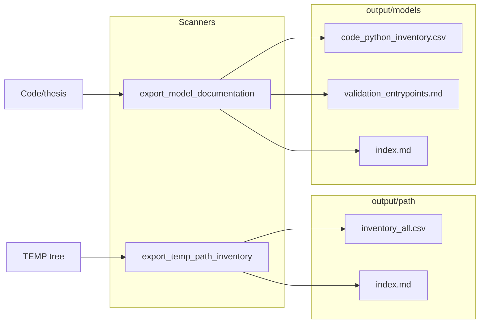

# Recursive TEMP inventory and Code-derived model docs

## Context

- [`TEMP/Code/thesis/tools/export_model_documentation.py`](TEMP/Code/thesis/tools/export_model_documentation.py) already writes [`TEMP/output/models/`](TEMP/output/models/) with `training_entrypoints.md` (only [`Code/thesis/train/train_*.py`](TEMP/Code/thesis/train)), `scripts_index.md`, checkpoints, configs, etc.
- There is no [`TEMP/output/path/`](TEMP/output/path/) yet; the user wants **every file and folder under TEMP** recorded there.
- Validation-related code lives outside `train/`, e.g. [`TEMP/Code/thesis/test/validate_all.py`](TEMP/Code/thesis/test/validate_all.py) and [`TEMP/Code/thesis/tools/eval_per_source_stem_metrics.py`](TEMP/Code/thesis/tools/eval_per_source_stem_metrics.py).

## 1. New tool: `output/path/` (full tree manifest)

**Add** [`TEMP/Code/thesis/tools/export_temp_path_inventory.py`](TEMP/Code/thesis/tools/export_temp_path_inventory.py)

- **Walk** `--repo-root` (default: same `_REPO` as other tools, i.e. `TEMP`) with `os.scandir` / `Path.rglob` in **depth-first or sorted** order for stable CSVs.
- **Each row** (files and directories): `relative_path`, `kind` (`file` | `dir`), `size_bytes` (0 for dirs; file size), `mtime_iso`. Optional: `suffix` for files.
- **Default excludes** (overridable) so a normal run stays useful and fast: skip entire subtrees that are huge or regenerated output, e.g. `output/`, `checkpoints/`, `data/`, `logs/`, and common junk `.git`, `__pycache__`, `.venv` — controlled by `--exclude-dir` (repeatable) plus `--no-default-excludes` for a **true** full tree when the user wants it.
- **Outputs** under `--output-dir` (default `output/path/`):
  - `index.md` — timestamp, args, exclude list, row counts, links to CSV.
  - `inventory_all.csv` — all included paths.
  - Optional `summary_by_topdir.md` — counts and total bytes per first path segment (e.g. `Code/`, `docs/`, `scripts/`).

**Add shell wrapper** [`TEMP/scripts/run_export_temp_path_inventory.sh`](TEMP/scripts/run_export_temp_path_inventory.sh) mirroring [`TEMP/scripts/run_export_model_documentation.sh`](TEMP/scripts/run_export_model_documentation.sh) (Unix newlines, `PYTHONPATH`, quoted paths).

## 2. Extend `output/models/` from `TEMP/Code`

**Edit** [`TEMP/Code/thesis/tools/export_model_documentation.py`](TEMP/Code/thesis/tools/export_model_documentation.py) (minimal, focused additions):

- **`code_python_inventory.csv`**: every `*.py` under `Code/` (or scoped to `Code/thesis/` to avoid unrelated trees if `Code/` has siblings — default `Code/thesis`): columns `relative_path`, `line_count`, `mtime_iso`, `module_doc_first_line` (reuse existing `extract_docstring_summary` logic or a one-line variant).
- **`validation_entrypoints.md`**: curated list of scripts that perform or orchestrate validation — at minimum glob `Code/thesis/test/**/*.py`, `Code/thesis/tools/*eval*.py`, `Code/thesis/tools/*valid*.py`, `Code/thesis/tools/analyze*.py` (if present), each with path + one-line docstring summary. Explicitly include `test/validate_all.py` and `tools/eval_per_source_stem_metrics.py` when present.
- **`code_tools_index.md`**: table of `Code/thesis/tools/*.py` (name + summary) for quick discovery.
- Update **`index.md`** in `output/models` to link these new artifacts.

No change to the attached plan file `model_documentation_export_d8e5c801.plan.md`.

## 3. Verification

- Run path inventory with default excludes; confirm `inventory_all.csv` and `index.md` exist and top-level dirs match expectations.
- Run with `--no-default-excludes` on a small test only if needed (or document that full-tree runs can be large).
- Re-run model documentation export; confirm new CSV/MD files and updated `index.md`.

## Risks

- **Full TEMP including `checkpoints/` and `data/`** can produce very large CSVs and long runtimes. Default excludes address this; document clearly in `index.md` and CLI `--help`.

