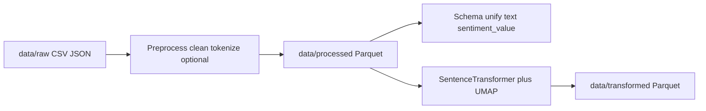

# Architecture: data pipeline (merged)

Sources: [`docs/mode-architecture_DataPreprocessing.md`](../../docs/mode-architecture_DataPreprocessing.md), [`docs/mode-architecture_FeatureExtraction.md`](../../docs/mode-architecture_FeatureExtraction.md), [`docs/mode-architecture_FinalNormalization.md`](../../docs/mode-architecture_FinalNormalization.md).

## End-to-end flow

## Stage 1 — Text preprocessing

- **Goal:** Load IMDB, Sentiment140, Yelp, and other raw files from `data/raw`; clean (HTML, encoding); optional tokenization via Hugging Face helpers; write **`data/processed`** as Parquet.
- **Implementation anchor:** `Code/thesis/data/preprocess.py` using `Code/data/clean_text.py` and related NLP utilities.
- **Non-goals:** Training, deep EDA, non-text feature engineering.

## Stage 2 — Final normalization (schema contract)

- **Goal:** Every processed dataset conforms to columns **`text`** and **`sentiment_value`** only.
- **Per-source column mapping** is fixed (e.g. `all-data.csv`, Amazon, tweets, HRAST, IMDB, medical, patient statements, Sentiment140, Yelp business/review)—see source doc for positional mapping.
- **Cleaning:** Strip bad UTF-8, regex for HTML/URLs; avoid dropping whole rows when a field can be salvaged.
- **Scale:** Chunked processing for very large files (Yelp, Amazon).

## Stage 3 — Feature extraction and manifold projection

- **Goal:** Map normalized text to **100-dimensional** dense vectors for classical/embedding-track models without storing full 384D embeddings on disk.
- **Encoder:** `sentence-transformers/all-MiniLM-L6-v2`, cached under `checkpoints/transformer/` (path in docs uses Windows drive letters; resolve relative to repo root on Linux).
- **UMAP fit:** At most **100,000** random rows per dataset to fit `umap.UMAP(n_components=100)`—avoids RAM blow-up on multi-million-row KNN graphs.
- **Transform:** Stream chunks through encoder then `umap_model.transform()`; write outputs to **`data/transformed/`** with feature column(s) such as `features_100d` (exact column names follow `embed_reduce.py` / merge scripts).
- **VRAM:** Cap `encode()` batch size (128–256) for 8GB-class GPUs.
- **Non-goals:** Persist full 384D vectors; one global UMAP across all datasets merged (per-dataset UMAP fits preserve local topology).

## Orchestrator alignment

The **PreprocessText** session ([`docs/tasks/orchestrator-sessions/PreprocessText/`](../../docs/tasks/orchestrator-sessions/PreprocessText/)) reported completion of architecture, `preprocess.py`, and execution producing `data/processed/*.parquet` with chunked JSON handling for Yelp-scale data.

## Related consolidated topics

- Fine-tuning and merge scripts: [TRAINING_ML_AND_RUNBOOKS.md](TRAINING_ML_AND_RUNBOOKS.md).
- Project rules on processed vs transformed: [PROJECT_AND_MODELS.md](PROJECT_AND_MODELS.md).
