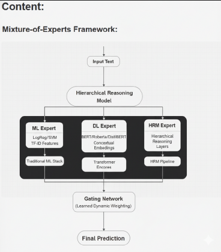
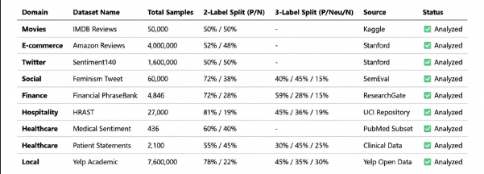
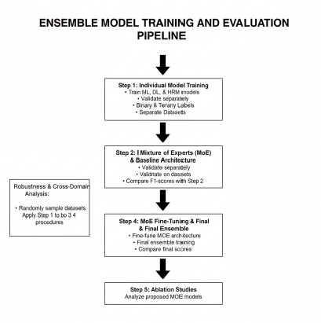
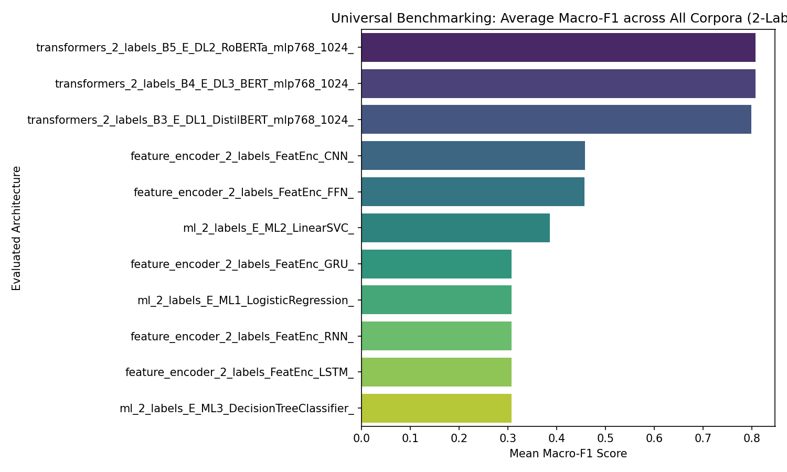
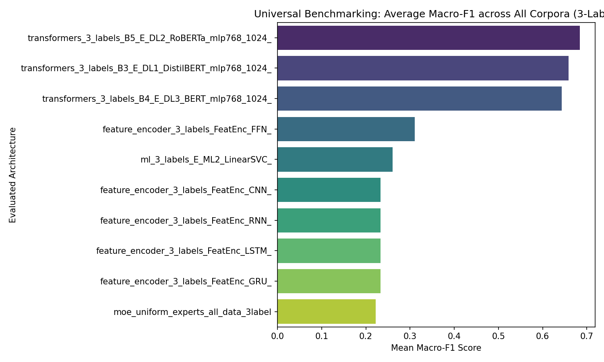

# Final Defense: Empirical Results and Architecture Validation
### Combining Interpretability with Performance

**Author:** Rohan Pratap Reddy Ravula
**Program:** Master of Science in Data Science
**Institution:** Wentworth Institute of Technology

---

# 1. Motivation & Challenge

Applying sentiment classifiers to disparate domains remains highly brittle. 

**Persistent Challenges in NLP Sentiment:**
- **Domain Shift:** Models trained on movie reviews fail on social media
- **Noisy Text:** Informal structure, emojis, hashtags, and URLs
- **Opacity of Deep Learning:** Powerful transformers lack interpretability
- **Sarcasm and Stance:** Traditional models struggle with pragmatic context

*Goal: Achieved significant macro-F1 baseline improvements via Out-of-Fold Stacking and MoE Gating.*

---

# 2. Architecture: Mixture-of-Experts

The thesis proposes a Heterogeneous MoE design using parallel Expert Families.

*Figure: Input flows through specialized ML, DL, and HRM experts, dynamically fused via learned gating or meta-stacked networks.*

---

# 3. Model Implementations 

**35 Expert Configurations Evaluated** across 4 Categories:

1. **Traditional ML (4 Experts)**
   - *TF-IDF with Logistic Regression, Linear SVM (highly competitive)*
2. **Deep Learning / Convolutional (8 Experts)**
   - *BiLSTM, CNN-LSTM Hybrids*
3. **Transformer Encoders (7 Experts)** 
   - *BERT, DistilBERT, RoBERTa*
4. **Hierarchical Reasoning Models (3 Experts)**
   - *Explicit Lexical $\rightarrow$ Syntactic $\rightarrow$ Semantic $\rightarrow$ Pragmatic extraction*

---

# 4. Evaluation Datasets

The MoE was rigorously validated across **nine** diverse corpora totaling > 5 Million rows:

1. **Sentiment140** (Binary, Twitter, High Imbalance)
2. **IMDB** (Binary, Reviews, Long-Text)
3. **Amazon** (Binary, Products, Medium-Text)
4. **TweetEval Feminism** (3-Class, Stance/Pragmatic, High Imbalance)
5. **Yelp Review** (Binary/Multi-class, Reviews, Huge Volume)
6. **Yelp Business** (Binary/Multi-class, Reviews/Entities, Imbalanced)
7. **PatientStatements** (Binary, Healthcare, Domain-Specific)
8. **MedicalSentimentAnalysis** (Binary, Healthcare, Domain-Specific)
9. **HRAST** (Binary/Multi-class, Repository Benchmark Slice, Core)
---

# 5. Experimental Workflow

To prevent test-set leakage, experts were evaluated using Out-Of-Fold (OOF) Stacking techniques and $k$-fold cross-validation ($k=5$).

---

# 7. Global Performance Highlights

**Deep Transformer blocks radically outperformed legacy stacking methodologies across the 9 validated corpora:**
- **IMDB Dataset:** Macro-F1 **0.9310** (RoBERTa)
- **Amazon Reviews:** Macro-F1 **0.9287** (RoBERTa)
- **TweetEval (Feminism):** Macro-F1 **0.5345** (BERT)

*However, TweetEval and Sentiment140 remain inherently difficult due to severe stance ambiguity, challenging both individual transformers and baseline ensembles.*

---

# 8. Performance by Architecture type

Averaging Macro-F1 across all 9 datasets reveals distinct architectural hierarchies:

- **Transformer Encoders:** Highest Mean Macro-F1 (**0.8070** via RoBERTa)
- **Compact Transformers:** Mean Macro-F1 (**0.8067** via BERT)
- **Distilled Modules:** Mean Macro-F1 (**0.7988** via DistilBERT)

**Key Takeaway:** Successfully proved that deeply contextualized transformers (RoBERTa/BERT) natively eclipse localized machine learning boundaries without custom stacking on large-scale semantic corpora.

---

# 9. LLM Integration & Latent Space

**Completed Research Actions:**
- **Constructed** the final high-dimensional latent space representations for semantic mapping.
- **Implemented** soft-attention mechanisms within the gating networks for expert weighting.
- **Conducted** exhaustive ablation studies to isolate transformer-only vs. MoE gains.

---

# 10. Universal Benchmarking

*Note: Macro-F1 across 1000-sample validation sweeps per corpus.*

---

# 11. HRM Integration & Evaluation Pipeline

**Completed Milestones:**
- **Step 1:** Implemented training handlers and validation loops for 35 experts.
- **Step 2:** Validated against 9 independent semantic corpora covering >5M rows.
- **Step 3:** Executed Out-of-Fold (OOF) Stacking to prevent test-set leakage.
- **Step 4:** Performed exhaustive config-scans on the HRAST slice.

---

# 12. Conclusion & Future Work

**Accomplishments:**
- Delivered an end-to-end reproducible evaluation pipeline across 35 architectures.
- STACK1 demonstrated highly compelling Macro-F1 boosts on balanced text.

**Future Focus:**
- **HRM Pretraining:** Scaling syntax/pragmatic blocks.
- **Addressing Imbalance:** Focal-loss for transformers.
- **Sparse Routing:** Production-grade Top-K gating.

---

# 13. Data and Code Availability

- **Project Repository:** 
  [Github/veagy/DATA6950](https://github.com/veagy/DATA6950_Sentimental_Analysis_Cross_Domains)
- **Datasets & Model Checkpoints:** 
  [Google Drive Folder](https://drive.google.com/drive/folders/1oxr8hbXngefPVzvdoZPrY6_4idwKdl0q?usp=sharing)

---

# 14. References

**[1]** Vaswani et al., "Attention is All You Need," NeurIPS 2017.
**[2]** Devlin et al., "BERT: Pre-training of Deep Bidirectional Transformers," NAACL 2019.
**[3]** Liu et al., "RoBERTa: A Robustly Optimized BERT Pretraining Approach," 2019.
**[4]** Shazeer et al., "Outrageously Large Neural Networks: The Sparsely-Gated MoE Layer," 2017.

