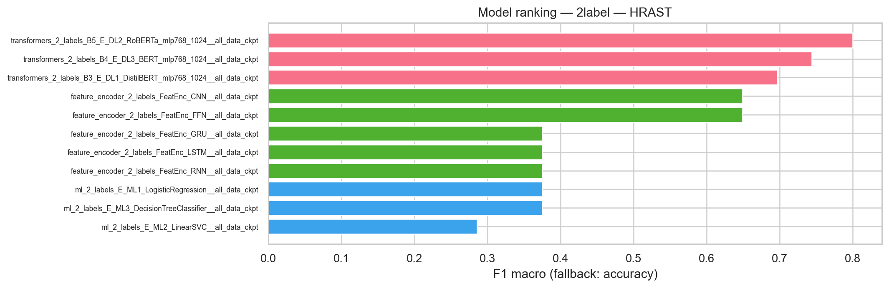
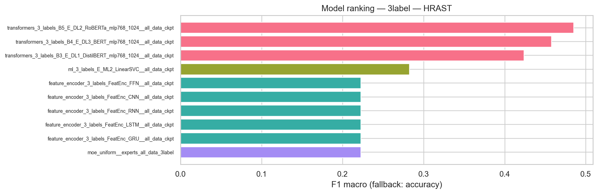
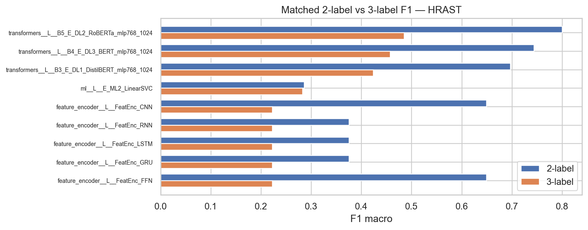

# Sentiment Analysis with Hierarchical Reasoning Models and Mixture-of-Experts: Implementation Summary

**Rohan Pratap Reddy Ravula**  
M.S. Data Science, School of Computing and Data Science, Wentworth Institute of Technology, Boston, MA, USA  
`ravular@wit.edu`

*This document synthesizes `THESIS_REPORT.md` and `THESIS_REPORT_NEW.md` into a single IEEE-style technical summary. Full page images and verbatim extracts remain in those files and in `../imgs/` (when those assets are present beside this folder).*

**Current repository snapshot (Sections I–VIII below)** restates the **original DATA 6900 thesis** narrative (four public datasets, global tables, STACK1 macro-F1 claims). **Section IX** documents the **live capstone tree** under `data/` → `output/` as regenerated by the analysis and eval tooling (dataset profiles, model inventory, HRAST stem metrics, and figures). Use Section IX for paths, row counts, and per-stem evaluation tied to this checkout.

---

## Abstract

This work implements and evaluates a **mixture-of-experts (MoE)** framework for sentiment analysis that combines **Hierarchical Reasoning Models (HRMs)**, classical **machine learning (ML)** experts, and **deep learning (DL)** / **transformer** experts. Predictions are fused via **stacking** (out-of-fold meta-learner) and **learned gating networks** (dense softmax and sparse top-*K* routing). The system is assessed on **four public datasets**—Sentiment140, IMDB, Amazon Reviews, and TweetEval Feminism—across **35 models** and **140 model–dataset pairs**. The best **STACK1** ensemble reaches **macro-F1 0.8911** (IMDB) and **0.8746** (Amazon). Empirically, **traditional ML** (TF-IDF + logistic regression / SVM) achieves the highest **mean** macro-F1 (**0.6389**) across conditions, while **transformers** and **HRMs** underperform in this experimental setup (**0.3099** and **0.2502** mean macro-F1 respectively), motivating ensemble design and future architecture and training refinements. The implementation emphasizes **modularity**, **reproducibility** (seeds, tracking, Docker), and **interpretability hooks** via HRM reasoning levels and expert attribution.

**Index Terms**—Sentiment analysis, mixture-of-experts, ensemble learning, hierarchical reasoning models, stacking, gating networks, natural language processing, macro-F1, domain shift.

---

## I. Introduction

### I-A Motivation

Sentiment analysis is central to feedback mining, social monitoring, and reputation systems. Progress from lexicons to transformers has not removed **domain shift**, **noisy user-generated text**, and **opacity** of deep models [1]–[4]. Single architectures capture complementary signals: **linear models** emphasize sparse lexical features; **sequence and transformer models** encode context; **HRM-style** designs aim for **layered** lexical → syntactic → semantic → pragmatic structure [8].

### I-B Problem and Goal

The objective is a **heterogeneous MoE** that (1) improves **macro-F1** and robustness versus strong single models, (2) supports **interpretable** expert contributions and, where available, **HRM reasoning traces**, and (3) remains **configurable** and **testable** for replication.

### I-C Contributions (Implementation-Oriented)

1. Modular **preprocessing → experts → ensemble → evaluation** pipeline.  
2. **Stacking** with **out-of-fold (OOF)** meta-features and **MoE** with **dense / sparse** gating.  
3. **35 models**, **four datasets**, **140** combinations, with **multi-seed** and **statistical** reporting.  
4. **Guidelines** for when ML vs. DL vs. ensembles dominate under observed data and compute constraints.

---

## II. Related Work (Condensed)

Prior art spans **CNN–LSTM hybrids** [12], **class-balanced** social sentiment [14], **deep ensembles** for social text [15], **multilingual** ensembles [13], and **stacking** with diverse bases [16], [17]. **Chain-of-thought** and **multi-step reasoning** [9], [18]–[21] motivate explicit structure; **HRMs** [8] organize multi-level reasoning. **Ensemble theory** (error diversity, stacking, boosting) [22]–[25] and **MoE / sparse routing** [26]–[29] underpin gating. **Domain adaptation** and **robustness** [5], [6], [30] motivate heterogeneous experts. Persistent issues include **sarcasm**, **negation**, **imbalance**, and **adversarial brittleness** [31]–[45]. This implementation targets **integration** of HRM + ML + DL under one evaluation protocol rather than a new backbone architecture.

---

## III. Methodology and System Design

### III-A High-Level Architecture

Four phases: **(1)** preprocessing and splitting, **(2)** expert training/inference, **(3)** ensemble combination (stacking ensembles **STACK1–7**, gating **MOE1–5**), **(4)** validation and reporting. The design favors **heterogeneity** (not multiple copies of one transformer) to increase **complementarity**.

### III-B Preprocessing

- **Deduplication** and **text cleaning** (URLs, HTML, mentions, hashtags, contractions, case).  
- **Tokenization**: subword (**BPE / WordPiece**) per model family.  
- **Splits**: stratified **train / validation / test**; **k-fold** for OOF stacking (**k = 5**).  
- **Labels**: binary and **multi-class** remapping (e.g., star ratings → sentiment classes).

### III-C Expert Families

| Family | Role | Examples (thesis IDs) |
|--------|------|------------------------|
| **ML** | Fast, interpretable baselines | **B1**, **B2**, **E-ML1**, **E-ML2** — TF-IDF (1–3 grams), max features 10K, LR / linear SVM, class weights |
| **DL** | Sequential / convolutional patterns | **BiLSTM+attention**, **CNN**, **E-DL\*** |
| **Transformers** | Contextual encoders | **DistilBERT**, **BERT**, **RoBERTa** (e.g., **B3**, **B5**, **E-DL3**) |
| **HRM** | Multi-level reasoning | **E-HRM1**–**E-HRM3** — levels **L1…L4** below |

### III-D HRM Formulation (Summary)

Lexical, syntactic, semantic, and pragmatic modules compose into a final representation:

- \(L_1 = \phi_1(x)\)  
- \(L_2 = \phi_2(x, L_1)\)  
- \(L_3 = \phi_3(x, L_1, L_2)\)  
- \(L_4 = \phi_4(x, L_1, L_2, L_3)\)  
- \(y_{\mathrm{HRM}} = f_{\mathrm{final}}(L_1, L_2, L_3, L_4)\)

The thesis uses this structure for **interpretable chains** (sentiment terms, negation, context, sarcasm / irony).

### III-E Ensemble Combination

**1) Stacking (e.g., STACK1)**  

1. Train each expert with **5-fold** CV.  
2. Collect **OOF** class probabilities (or logits) per expert.  
3. Train **meta-learner** (e.g., **logistic regression**) on concatenated OOF features.  
4. Evaluate on held-out test **without** leakage.

**2) MoE gating**  

- **Dense**: \(g_i(x) = \mathrm{softmax}(W_i^\top h(x))_i\) over experts \(f_i\).  
- **Prediction**: \(\hat{y} = \sum_i g_i(x)\, f_i(x)\).  
- **Sparse top-*K***: normalize only over selected experts for efficiency.

**3) Loss and optimization**  

- **Weighted cross-entropy** for imbalance.  
- **AdamW**; LR \(\sim 2\times10^{-5}\) (transformers), \(\sim 10^{-3}\) (ML).  
- **Warmup + decay**, **early stopping** on **macro-F1**, **gradient clipping**.

### III-F Validation Protocol

- **Metrics**: **macro-F1** (primary), accuracy, precision, recall, **AUROC**, latency, memory, model size.  
- **Seeds**: e.g., **42**, **123**, **456** / **2024** (as in thesis).  
- **Significance**: paired tests, **95%** CIs, **Cohen’s *d*** where reported.  
- **Cross-domain**: e.g., train **Sentiment140**, test **Amazon** (retention targets stated in thesis).

### III-G Software Stack

- **Python 3.9+**, **PyTorch 2.0+**, **Hugging Face Transformers**, **scikit-learn**, **NumPy/Pandas**, **Matplotlib/Seaborn**, **Weights & Biases** / **MLflow**, optional **Docker**.  
- **Layout** (thesis): `config/`, `models/` (ml, dl, transformer, **hrm/**, **ensemble/**), `train/`, `utils/`, `test/`, `checkpoints/`, `datasets/`, `notebooks/`.

---

## IV. Datasets

| Dataset | Scale (thesis) | Task | Notes |
|---------|----------------|------|--------|
| **Sentiment140** | \(\sim\)1.05M tweets | Binary | **Imbalanced** (e.g., \(\sim\)23.7% / 76.3%), short, noisy |
| **IMDB** | 50K reviews | Binary | Balanced, **long** text |
| **Amazon Reviews** | \(\sim\)4M reviews | Binary | Balanced, medium length, product lexicon |
| **TweetEval Feminism** | \(\sim\)60K tweets | **3-class** stance | Imbalanced multi-class |

**Quality**: low missingness; duplicate rates small; length and class distributions drive preprocessing (truncation, class weights, focal / sampling strategies where used). **Figures 1–5** in the thesis illustrate distributions (see `../imgs/DATA_6900_Final_Thesis_page_0011.png` and neighbors).

---

## V. Experimental Results (Summary)

### V-A Global Statistics (TABLE III–Style)

| Metric | Mean | Std (across experiments) |
|--------|------|---------------------------|
| Macro-F1 | **0.4557** | 0.2187 |
| Accuracy | 0.5402 | 0.1899 |
| Precision | 0.5051 | 0.2103 |
| Recall | 0.5591 | 0.2012 |

### V-B Performance by Model Type (TABLE IV)

| Model type | Mean macro-F1 | Std |
|------------|---------------|-----|
| **Traditional ML** | **0.6389** | 0.2775 |
| RNN | 0.5241 | 0.2686 |
| CNN | 0.4719 | 0.2514 |
| Ensemble | 0.4660 | 0.1714 |
| Transformer | 0.3099 | 0.1125 |
| HRM | 0.2502 | 0.0301 |

### V-C Performance by Dataset (TABLE V)

| Dataset | Mean macro-F1 | Difficulty (thesis) |
|---------|---------------|-------------------|
| IMDB | 0.6068 | Medium |
| Amazon | 0.5839 | Medium |
| Feminism TweetEval | 0.3531 | Hard |
| Sentiment140 | 0.2791 | Very hard |

### V-D Top Ensemble and Best Singles (TABLE VI–VII)

- **STACK1** (stacking ensemble): **0.8911** macro-F1 (**IMDB**), **0.8746** (**Amazon**), **0.6283** (**Feminism**); strong vs. **E-ML2** / **B2** (\(\sim\)0.8887 / 0.8665 on IMDB/Amazon).  
- **Sentiment140**: best single model **E-DL3** (BERT) **0.5004** macro-F1; all models struggle on imbalance/noise.

### V-E Ensemble Comparison (TABLE VIII)

- **STACK1** average macro-F1 **\(\sim\)0.6517** vs. **\(\sim\)0.4820** for simpler ensembles (**ENS1–3**, **MOE1–3**, some **STACK** variants).  
- **STACK4** (HRM-heavy) **\(\sim\)0.2552** — indicates weak HRM signal under current training.

### V-F Binary vs. Multi-Class (TABLE IX)

- Binary mean macro-F1 **0.4899** vs. multi-class **0.3531** (expected complexity gap).

*Plots: Fig. 6–12 in the thesis PDF/PNGs correspond to these tables.*

---

## VI. Discussion

1. **ML strength**: TF-IDF + linear models remain **competitive** and anchor the best stacks—**feature engineering** is not obsolete for these corpora.  
2. **STACK1**: Demonstrates **measurable gains** on balanced / medium-length data when diverse experts are combined with a **meta-learner**.  
3. **Transformers**: Underperformance likely reflects **tuning depth**, **sequence length**, **imbalance**, and **compute** limits relative to scale of data.  
4. **HRMs**: Low mean F1 suggests **architecture–task mismatch**, **pretraining** needs, or **integration** issues; **STACK4** reinforces caution.  
5. **Sentiment140**: Highlights **class imbalance** and **noise** as dominant factors—ensemble design cannot fully compensate without **sampling / loss** strategies.  
6. **Interpretability**: HRM levels and **expert weights** (MoE) provide **audit surfaces** even when raw HRM accuracy is low.

---

## VII. Implementation Artifacts

### VII-A Reproducibility

- Fixed seeds, logged hyperparameters, checkpoints (best / last / periodic), and containerized environment per thesis **validation plan**.

### VII-B Example Commands (thesis Appendix)

```bash
pip install -r requirements.txt
python src/train/train_model.py --model_id B1 --dataset sentiment140 --epochs 10
python src/evaluate/evaluate_ensemble.py --ensemble_id STACK1 --dataset imdb
```

### VII-C Core Algorithms (Pseudocode Scope)

- **Algorithm 1**: Dataset exploration (load, stats, plots).  
- **Algorithm 2**: Text cleaning pipeline.  
- **Algorithm 3**: Stacking with OOF collection and meta-learner.  
- **Algorithm 4**: MoE forward + load-balancing idea.  
- **Algorithm 5**: HRM forward pass.  
- **Algorithm 6**: Generic training loop (AdamW, early stopping, checkpointing).

*(Full line-by-line pseudocode appears in `THESIS_REPORT_NEW.md` pages 39–44.)*

---

## VIII. Conclusion

The implemented **MoE + stacking** system achieves **state-of-the-near** ensemble results on **IMDB** and **Amazon** under the reported protocol, while **surface-form** challenges (**Sentiment140**, **Feminism**) and **HRM / transformer** gaps point to **targeted future work**: stronger **HRM pretraining**, **transformer** HPO, **imbalance-aware** training, and **lighter** experts for deployment. The codebase structure supports **swapping experts**, **ablations**, and **extended gating** without rewriting the full pipeline.

---

## IX. Capstone repository: data, models, and HRAST evaluation (regenerated outputs)

This section reflects artifacts under [`output/`](../../) produced from the current [`data/`](../../../data) tree (processed and transformed Parquet), plus checkpoint-driven evaluation. Regenerate with: `Code/thesis/data/preprocess.py` → `Code/thesis/tools/analyze_thesis_datasets.py` → `Code/thesis/tools/eval_per_source_stem_metrics.py` (when the local PyTorch / transformer stack matches the training code) → `output/scripts/generate_all_charts.py` → optional `export_model_documentation.py` and `export_temp_path_inventory.py`.

### IX-A Dataset scale and processed vs transformed alignment

Merged corpus Parquet (`processed/all-data.parquet` vs `transformed/all-data.parquet`) contains **9,514,666** rows; **source_stem** distributions match between processed and transformed (full-column verification in [`output/dataset analysis/alignment_report.md`](../../dataset%20analysis/alignment_report.md)).

Per-file alignment checks cover **IMDB** (50,000 rows), **Amazon** sample (1,048,575 rows), **Sentiment140** (1,046,518 rows), **tweet_eval**, **Yelp** business/review slices, **HRAST** standalone Parquet (**23,113** rows in the file-level profile), and additional medical/patient extracts. The **HRAST** rows used for **per-`source_stem` split evaluation** live under `data/processed/by_source_stem/HRAST.parquet` (**4,000** rows in the latest profile; text column `text`, label `sentiment_value`, 3-class distribution sampled in [`output/dataset analysis/per_file/processed__by_source_stem__HRAST.parquet/report.md`](../../dataset%20analysis/per_file/processed__by_source_stem__HRAST.parquet/report.md)).

### IX-B Model and codebase footprint

The exported catalog ([`output/models/index.md`](../../models/index.md)) summarizes the thesis codebase as of the last export: **75** config JSON files, **87** checkpoint weight files (`*.safetensors` / `*.joblib`), **6** MoE manifest summaries, **25** `run_meta.txt` traces, **52** Python modules under `Code/thesis/`, and **3** validation entrypoint scripts. Repository layout statistics appear in [`output/path/summary_by_topdir.md`](../../path/summary_by_topdir.md) (full file inventory: [`output/path/inventory_all.csv`](../../path/inventory_all.csv)).

### IX-C HRAST stem metrics (config-scan and MoE manifest)

Evaluation targets are discovered from configs under `Code/thesis/config` and optional `run_meta.txt` hints; metrics are written under `output/metrics/{2,3}label/HRAST/<model_id>/metrics.json`. Rollups: [`output/metrics/summary.csv`](../../metrics/summary.csv) (**one row per model × label mode** in the latest rebuild), [`output/metrics/2label_metrics_table.csv`](../../metrics/2label_metrics_table.csv), [`output/metrics/3label_metrics_table.csv`](../../metrics/3label_metrics_table.csv).

**Aggregation rule:** After regeneration, `summary.csv` contains **32** rows (16 two-class + 16 three-class) with **no duplicate** `model_id` within a label mode—suitable as the single summary table for this checkout.

**Two-class (binary) HRAST** — highest **macro-F1** on the recorded run: **RoBERTa** MLP head **0.800** (accuracy 0.80); **BERT** **0.744** (accuracy 0.75); **DistilBERT** **0.697** (accuracy 0.70). **Feature-encoder** CNN and FFN reach **0.649** macro-F1; several RNN/LSTM/GRU and linear baselines sit near **0.375–0.40** macro-F1 on this slice.

**Three-class HRAST** — best **macro-F1**: **RoBERTa** **0.485** (macro ROC-AUC OVR **0.795**); **BERT** **0.458** (ROC-AUC **0.758**); **DistilBERT** **0.424** (ROC-AUC **0.745**). **Uniform MoE** over the 3-label expert manifest achieves macro-F1 **0.222** with ROC-AUC **0.601** ([`moe_uniform__experts_all_data_3label`](../../metrics/3label/HRAST/moe_uniform__experts_all_data_3label/metrics.json)). Several **feature_encoder** experts show **0.222** macro-F1 with near-chance balanced accuracy on the held-out stem slice.

**Failed or skipped loads (documented in `summary.csv` / per-`metrics.json`):** All **`mlp_gelu_head_ddp_*`** rows report `load_model: dictionary update sequence element #0 has length 1; 2 is required`. **`ml_3_labels_E_ML1_LogisticRegression`** fails with a **state_dict shape mismatch** (checkpoint trained for 3 output units vs loader expecting 2). These rows should be interpreted as **engineering debt**, not model quality.

**Sample size caveat:** Per-model tables include **`n_samples`** on the order of **tens** of labeled points for this stem-specific eval—appropriate for **smoke / regression** checks, not for claims comparable to the full-dataset thesis tables in Sections V–VI.

### IX-D Figures (generated charts)

Charts live under [`output/charts/`](../../charts/) (full manifest: [`output/charts/index.md`](../../charts/index.md)). Representative PNGs (paths relative to this file):

| Caption | File |
|--------|------|
| HRAST 2-label macro-F1 ranking | `../../charts/metrics/2label/ranking_f1_HRAST.png` |
| HRAST 3-label macro-F1 ranking | `../../charts/metrics/3label/ranking_f1_HRAST.png` |
| Paired 2- vs 3-label F1 | `../../charts/metrics/combined/paired_f1_HRAST.png` |
| Label distribution (processed HRAST stem slice) | `../../charts/dataset_analysis/labels_processed__by_source_stem__HRAST.parquet.png` |
| Confusion matrix (2-label RoBERTa expert) | `../../charts/metrics/confusion/2label_HRAST_transformers_2_labels_B5_E_DL2_RoBERTa_mlp768_1024__all_data_ckpt.png` |







### IX-E Documentation and reproducibility

- **Consolidated project docs index:** [`output/docs/INDEX.md`](../../docs/INDEX.md) (rollups: [`PROJECT_AND_MODELS.md`](../../docs/PROJECT_AND_MODELS.md), [`ARCHITECTURE_PIPELINE.md`](../../docs/ARCHITECTURE_PIPELINE.md), [`TRAINING_ML_AND_RUNBOOKS.md`](../../docs/TRAINING_ML_AND_RUNBOOKS.md)). These files summarize `docs/` and plan material; they are **not** regenerated from `data/` alone.
- **Chart generation:** `output/scripts/generate_all_charts.py` with dependencies in `output/scripts/requirements-charts.txt`. On Windows, set `MPLCONFIGDIR` to a writable temp directory before running (see script header). Shell wrapper: `output/scripts/run_generate_charts.sh` (Unix-oriented).

---

## References

Numbered citations **[1]–[67]** refer to the bibliography in the **full thesis PDF** and the extracted markdown reports. Primary sources cited in-text include survey and **BERT/RoBERTa** work, **ensemble** and **MoE** foundations, **sentiment** and **robustness** studies, and **HRM** [8] / reasoning [9], [18]–[21] as summarized in **Section II** of the thesis.

---

## Figure and Source Index

| Resource | Path |
|----------|------|
| Full page renders (thesis PDF export) | `../imgs/DATA_6900_Final_Thesis_page_####.png` — only if `output/thesis/imgs/` (or sibling `imgs/`) is populated |
| Verbatim + page structure | `THESIS_REPORT.md`, `THESIS_REPORT_NEW.md` |
| Source PDF | Place `DATA_6900_Final_Thesis.pdf` beside this folder (`output/thesis/`) or update the path you keep locally |
| Dataset analysis (profiles, alignment) | [`output/dataset analysis/`](../../dataset%20analysis/) |
| Metrics JSON + CSV rollups | [`output/metrics/`](../../metrics/) |
| Generated figures (metrics, EDA, models, path) | [`output/charts/`](../../charts/) (`index.md` lists all PNGs) |
| Model export catalog | [`output/models/`](../../models/) |
| Path inventory | [`output/path/`](../../path/) |

---

*Document version: Sections I–VIII — implementation summary derived from thesis extracts (DATA 6900, December 2025). Section IX — synchronized with regenerated `output/` artifacts from the repository `data/` tree (see timestamps in `output/dataset analysis/index.md`, `output/charts/index.md`, `output/models/index.md`).*
