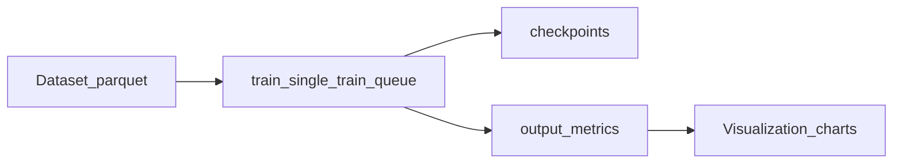

# Cross-Domain Sentiment Analysis (HRM, Transformers, and Mixture-of-Experts)

**Repository:** `DATA6950_Sentimental_Analysis_Cross_Domains`  
**Author:** Rohan Pratap Reddy Ravula — MS in Data Science, School of Computing and Data Science, Wentworth Institute of Technology  
**Thesis PDF (root):** [`main.pdf`](main.pdf)

This capstone project studies **sentiment analysis across domains** by combining **Hierarchical Reasoning Models (HRMs)**, **transformer encoders** (e.g. DistilBERT, BERT, RoBERTa), **classical ML**, **CNN/RNN/feature-encoder** pipelines, and **mixture-of-experts (MoE)** components. Training, evaluation, and configuration code live under [`Code/`](Code/); datasets and large binaries are restored separately (see below).



---

## Repository layout

| Path | Purpose |
|------|---------|
| [`Code/`](Code/) | Model library (`Code/models/`), configs (`Code/config/`, `Code/thesis/config/`), thesis training entrypoints (`Code/thesis/train/`), data utilities (`Code/thesis/data/`), tools (`Code/thesis/tools/`), and tests (`Code/test/`). |
| [`Dataset/`](Dataset/) | Intended home for **`raw/`**, **`processed/`**, and **`transformed/`** Parquet trees (not committed; see [`Dataset/README.md`](Dataset/README.md)). |
| [`Other/`](Other/) | **`checkpoints/`** (weights), **`output/`** (metrics rollups, thesis build outputs, mirrored docs), and **`scripts/`** (training pipeline notes and shell helpers). |
| [`Visualization/`](Visualization/) | Chart generator scripts and **committed PNG** figures under `Visualization/charts/`. |
| [`main.pdf`](main.pdf) | Compiled thesis (PDF). LaTeX sources and generated figures may also live under `Other/output/thesis/` locally. |
| [`requirements.txt`](requirements.txt) | Python dependencies for thesis training and model code. |

---

## What is not in Git

The [`.gitignore`](.gitignore) keeps the repository lightweight. Typical exclusions:

- **Virtual env:** `.venv/`
- **Dataset Parquet trees:** `Dataset/raw/`, `Dataset/processed/`, `Dataset/transformed/`
- **Model checkpoints:** under `Other/checkpoints/` (see ignore rules for subtrees)
- **Thesis figure exports:** `Other/output/thesis/imgs/`
- **Caches / secrets:** `__pycache__/`, `.pytest_cache/`, `.env`
- **Local issue drafts:** `issues_markdown/` (optional; not shipped in every clone)

Clone the repo, then restore **data** and **checkpoints** using the READMEs linked below.

---

## Restore datasets and checkpoints (Google Drive)

| Artifact | Where to read | Google Drive |
|----------|----------------|--------------|
| **Datasets** | [`Dataset/README.md`](Dataset/README.md) | [Dataset folder](https://drive.google.com/drive/folders/1M3TfrFmJBExkmh8eJynQHVevgX5IP_82?usp=sharing) |
| **Checkpoints** | [`Other/checkpoints/README.md`](Other/checkpoints/README.md) | [Checkpoints folder](https://drive.google.com/drive/folders/1XptLnqd2ycvWgQM_u37c7Leop10xkpKk?usp=sharing) |

Place downloaded content so local paths match those READMEs (`Dataset/{raw,processed,transformed}`, checkpoint subtrees next to `Other/checkpoints/README.md`).

---

## Environment setup

1. **Python:** 3.10+ recommended (match your PyTorch build).
2. **Create a venv** (from repository root):

   ```bash
   python -m venv .venv
   .venv\Scripts\activate   # Windows
   # source .venv/bin/activate   # Linux / macOS
   ```

3. **Install dependencies:**

   ```bash
   pip install -r requirements.txt
   ```

4. **CUDA / PyTorch:** The stack expects **PyTorch** with CUDA for full GPU training. If you need a CUDA wheel (example: cu124), see the venv snippet in [`Other/scripts/README.md`](Other/scripts/README.md). CPU-only installs may work for small smoke tests but not for large transformer jobs.

5. **Optional extras:** `requirements.txt` mentions `requirements-dev.txt` and `requirements-monorepo-extras.txt` for broader monorepo features; those files are **not** included in this repo—add your own dev deps (e.g. `pytest`) as needed.

6. **Heavy / GPU-only packages:** `bitsandbytes`, `accelerate`, and `peft` are listed for MoE/quantization-style workflows; they assume a suitable GPU/driver where used.

---

## Path conventions (read this before training)

[`Code/thesis/train/train_single.py`](Code/thesis/train/train_single.py) defaults to repository-root paths:

- **`--data_root`** → `<repo>/data` (must contain `processed/` and `transformed/`)
- **`--checkpoint_root`** → `<repo>/checkpoints`
- **`--log_dir`** → `<repo>/logs`

This repository ships **`Dataset/`** (not `data/`) and documents checkpoints under **`Other/checkpoints/`**. Metrics and rollups in this tree often live under **`Other/output/metrics/`**, while the chart script expects **`output/metrics/`** relative to the `--repo-root` you pass.

**Pick one approach:**

| Goal | Option A: junctions / symlinks (recommended) | Option B: CLI flags / copies |
|------|---------------------------------------------|------------------------------|
| Data | `data` → `Dataset` | Pass `--data_root Dataset` on every run |
| Checkpoints | `checkpoints` → `Other/checkpoints` | Pass `--checkpoint_root Other/checkpoints` |
| Metrics / charts | `output` → `Other/output` | Copy or symlink `Other/output/metrics` → `output/metrics`, or pass `--repo-root` only if layout already matches script expectations |

**Windows (junction example, from repo root, elevated if needed):**

```cmd
mklink /J data Dataset
mklink /J checkpoints Other\checkpoints
mklink /J output Other\output
```

**Linux / macOS:**

```bash
ln -s Dataset data
ln -s Other/checkpoints checkpoints
ln -s Other/output output
```

After linking, defaults in `train_single.py` and `Visualization/scripts/generate_all_charts.py` align with this repository’s folder names.

---

## How to run training (minimal example)

From **repository root**, with data available under your chosen `data_root`:

```bash
python Code/thesis/train/train_single.py ^
  --config Code/thesis/config/transformers/2_labels/B3_E_DL1_DistilBERT.json ^
  --dataset_stem IMDB_Dataset ^
  --data_root data
```

(On PowerShell, use backtick `` ` `` for line continuation instead of `^`.)

**Distributed (two GPUs, Linux/WSL example):**

```bash
python -m torch.distributed.run --nproc_per_node=2 Code/thesis/train/train_single.py \
  --config Code/thesis/config/transformers/2_labels/B3_E_DL1_DistilBERT.json \
  --dataset_stem IMDB_Dataset \
  --data_root data
```

**Full thesis pipelines** (HRM pretrain, feature-encoder queue, `train_queue.py`, environment variables such as `THESIS_*`, merge scripts, and detached runs) are documented in **[`Other/scripts/README.md`](Other/scripts/README.md)**—use that as the operational source of truth.

Other entrypoints you may see: [`Code/thesis/train/train_queue.py`](Code/thesis/train/train_queue.py), [`Code/train/pipeline_train.py`](Code/train/pipeline_train.py), [`Code/thesis/train/train_all.py`](Code/thesis/train/train_all.py).

---

## Data pipeline (high level)

Scripts under [`Code/thesis/data/`](Code/thesis/data/) prepare Parquet corpora—for example:

- Merge per-stem processed shards into `processed/all-data.parquet`: [`merge_all_data_parquet.py`](Code/thesis/data/merge_all_data_parquet.py)
- Merge transformed shards: [`merge_all_transformed_parquet.py`](Code/thesis/data/merge_all_transformed_parquet.py)
- Embeddings + dimensionality reduction (SentenceTransformer + UMAP → 100D features): [`embed_reduce.py`](Code/thesis/data/embed_reduce.py)

**Important:** If each stem was embedded with its own UMAP fit, concatenating transformed shards **mixes embedding spaces**. For one consistent space over the full corpus, prefer merging **processed** data first, then running `embed_reduce.py` on `all-data` (see notes in [`Other/scripts/README.md`](Other/scripts/README.md)).

Optional EDA: [`Code/thesis/tools/analyze_thesis_datasets.py`](Code/thesis/tools/analyze_thesis_datasets.py).

---

## Metrics, evaluation, and charts

- **Per-run metrics:** JSON files under `Other/output/metrics/` (e.g. by label mode and dataset stem), produced during training/evaluation workflows.
- **Aggregated tables:** CSVs such as `output/metrics/2label_metrics_table.csv` and `3label_metrics_table.csv` are consumed by the chart generator when present under the **repo root `output/metrics/`** path (hence the `output` → `Other/output` junction recommendation).
- **Regenerate figures** (needs `pandas`, `matplotlib`, `seaborn`):

  ```bash
  pip install -r Visualization/scripts/requirements-charts.txt
  python Visualization/scripts/generate_all_charts.py --repo-root .
  ```

  Default output: `output/charts/` (with junction above, this is `Other/output/charts`).  
  **Note:** `Visualization/scripts/run_generate_charts.sh` currently points at `output/scripts/generate_all_charts.py`, which does not match this layout; prefer the `python Visualization/scripts/generate_all_charts.py` command above.

- **Committed plots:** Browse [`Visualization/charts/`](Visualization/charts/) (`dataset_analysis/`, `metrics/confusion/`, rankings, etc.).

- **Per-source-stem metrics tooling:** [`Code/thesis/tools/eval_per_source_stem_metrics.py`](Code/thesis/tools/eval_per_source_stem_metrics.py) (build tables and related summaries from `metrics.json`).

---

## Tests

Tests live under [`Code/test/`](Code/test/). [`Code/test/conftest.py`](Code/test/conftest.py) resolves the repository root and bootstraps lazy model loading—run pytest **from the repository root** so imports like `Code.*` resolve.

Install a test runner (not pinned in root `requirements.txt`):

```bash
pip install pytest
```

Run:

```bash
python -m pytest Code/test
```

Some tests exercise heavy or GPU paths and may skip or require extra dependencies.

---

## Documentation index

| Document | Notes |
|----------|--------|
| [`Other/output/thesis/docs/docs/THESIS_MASTER_DOCUMENT.md`](Other/output/thesis/docs/docs/THESIS_MASTER_DOCUMENT.md) | Consolidated thesis reference (models, methodology, links to subdocs). |
| [`Other/docs/README.md`](Other/docs/README.md) | Long-form project documentation; **some paths may point to older drive letters**—prefer paths in *this* repo when they differ. |
| [`Other/scripts/README.md`](Other/scripts/README.md) | Training commands, env vars, merge/UMAP caveats, HRM + queue behavior. |
| [`Dataset/README.md`](Dataset/README.md) / [`Other/checkpoints/README.md`](Other/checkpoints/README.md) | Restoring large artifacts. |
| [`Code/thesis/config/hrm/README.md`](Code/thesis/config/hrm/README.md) / [`Code/thesis/config/moe/README.md`](Code/thesis/config/moe/README.md) | Config-focused notes for HRM and MoE. |

---

## License and attribution

There is **no `LICENSE` file** in the repository root yet; treat usage as **all rights reserved** until you add an explicit license. When publishing or submitting coursework, **cite** upstream **Hugging Face** models, **dataset** sources (IMDB, Amazon, TweetEval, etc.), and any third-party code per your program’s academic integrity rules.

---

*For a concise issue-style spec that motivated this README, see local notes under `issues_markdown/` if present (that folder may be gitignored).*
